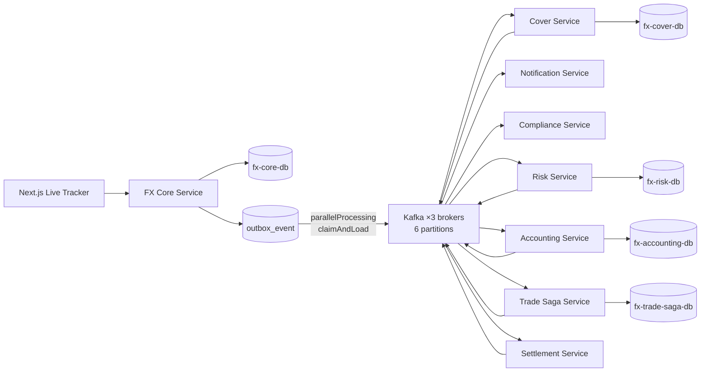

# FX Trading Sample

FX トレーディングを題材に、`ACID + Saga` ハイブリッドアーキテクチャを `Spring Boot + Apache Camel 4 + Kafka + PostgreSQL + Next.js` で実装したサンプルです。

このリポジトリでは、以下を確認できます。

- 約定コアを単一サービス内の ACID トランザクションで確定する実装
- 後続業務を Kafka + Saga で非同期連携する実装
- Outbox による送信保証と Consumer 側冪等
- 補償をロールバックではなく業務的打消しで表現する実装
- UI から実際にリクエストを送り、各サービスの動作をライブ追跡するトラッカー

## 構成

- `backend/`: Maven マルチモジュール構成のバックエンド（8 サービス + common + integration-tests）
- `frontend/`: Next.js ベースのライブトレース UI
- `openshift/`: OpenShift デプロイマニフェスト（DB 分離構成 / Observability スタック）
- `loadtest/`: k6 負荷試験スイート + Python 実行スクリプト
- `design/`: 設計ドキュメント群

### 設計ドキュメント

| ファイル | 内容 |
|----------|------|
| `design/design.md` | アーキテクチャ設計書（ACID/Saga 境界、データモデル、イベント経路、Java DSL サンプル） |
| `design/implementation-guide.md` | 実装ガイド（トランザクション詳細、Outbox フロー、Camel の使い方） |
| `design/coding-standards.md` | コーディング基準 |
| `design/db-separation-plan.md` | サービス別 DB 分離設計（実装済み） |
| `design/problems-and-mitigations.md` | 問題と対策の整理（補償順序、Outbox 最適化、スケーリング・パラドクス対処） |
| `design/test-plan.md` | テスト計画（負荷モデル、シナリオ、閾値） |
| `design/sharding-and-domain-split-roadmap.md` | シャーディング・ドメイン分割ロードマップ |
| `design/discussion/` | 外部レビューのディスカッション記録 |

## 全体像



## クイックスタート

### 1. バックエンドをビルド

```bash
cd backend
mvn -DskipTests package
```

### 2. Podman で起動

```bash
cd backend
podman compose -f compose.yaml up -d --build
```

### 3. フロントエンドを起動

```bash
cd frontend
npm install
npm run dev
```

### 4. ブラウザで確認

- UI: `http://localhost:3000`
- FX Core API: `http://localhost:8080/api/trades`

### コンテナ化したフロントエンドを使う場合

`podman compose` で `frontend` も含めて起動した場合の UI は以下です。

- UI(Container): `http://localhost:3400`

## ライブトレース UI

フロントエンドは、単なるシナリオ再生ではありません。

- UI から `POST /api/trades` を実行
- 返却された `tradeId` を保持
- `GET /api/trades/{tradeId}/trace` をポーリング
- `trade_saga`、`outbox_event`、`trade_activity` を組み合わせて表示

表示できる内容:

- ACID 確定後の取引状態
- Saga 全体の状態
- 各マイクロサービスの状態
- Outbox イベントの送信状況
- 各サービスが実際に実行した活動履歴
- 補償が発生した場合の打消しフロー

## テスト

### バックエンド結合テスト

```bash
cd backend
mvn -pl integration-tests -am test
```

このテストでは、Kafka / PostgreSQL 付きで全サービスを起動し、以下を検証します。

- `TradeExecuted -> Saga COMPLETED`
- `CoverTradeFailed -> 補償 -> Saga CANCELLED`

### フロントエンド検証

```bash
cd frontend
npm run lint
npm run build
```

## OpenShift デプロイ

OpenShift 向けマニフェストは `openshift/` にあります。`oc apply -f` で適用できるように作成してあります。

### 1. バックエンド JAR をビルド

```bash
cd backend
mvn -DskipTests package
```

### 2. フロントエンドをビルド確認

```bash
cd frontend
npm install
npm run build
```

### 3. OpenShift プロジェクトを作成

```bash
oc apply -f openshift/project.yaml
oc project fx-trading-sample
```

### 4. OpenShift 内蔵レジストリへイメージを push

```bash
REGISTRY="$(oc registry info --public)"
NAMESPACE="fx-trading-sample"
USER_NAME="$(oc whoami)"
TOKEN="$(oc whoami -t)"

podman login "$REGISTRY" -u "$USER_NAME" -p "$TOKEN" --tls-verify=false

for image in fx-core-service trade-saga-service cover-service risk-service accounting-service settlement-service notification-service compliance-service frontend; do
  podman tag "backend-${image}:latest" "$REGISTRY/$NAMESPACE/${image}:latest"
  podman push --tls-verify=false "$REGISTRY/$NAMESPACE/${image}:latest"
done
```

### 5. OpenShift マニフェストを適用

```bash
oc apply -f openshift/fx-trading-stack.yaml
```

### 6. Observability スタックを適用

```bash
oc apply -f openshift/observability-stack.yaml
```

### 7. 状態確認

```bash
oc get pods
oc get svc
oc get routes
```

### 8. アクセス確認

`frontend` Route の URL を開きます。

```bash
oc get route fx-frontend
```

Observability の Route は以下です。

```bash
oc get route fx-grafana
oc get route fx-prometheus
```

Grafana 初期ログイン:

- User: `admin`
- Password: `admin123`

### 8.5 CDC（Kafka Connect + Debezium）を適用する場合

任意で CDC を検証する場合は、`Kafka Connect` と `Debezium` を追加で適用します。

```bash
oc apply -f openshift/fx-kafka-connect-cdc.yaml
oc get pods
oc get jobs
```

この manifest は、現時点では **本番 topic ではなく shadow topic** へ配信します。

- `shadow.fx-trade-events`

初期の connector 状態確認例:

```bash
oc port-forward svc/fx-kafka-connect 18082:8083
curl -s http://localhost:18082/connectors
curl -s http://localhost:18082/connectors/fx-core-outbox-connector/status
```

期待値:

- connector: `RUNNING`
- task: `RUNNING`

検証レポートは `loadtest/reports/cdc-shadow-validation-2026-04-10.md` を参照。

補足:

- 現在のマニフェストは PoC 用の単一ノード構成です。
- PostgreSQL と Kafka は OpenShift 上でも同梱デプロイします。
- アプリケーションイメージ参照先は `fx-trading-sample` プロジェクトの内蔵レジストリです。
- 他の namespace に展開する場合は、`openshift/fx-trading-stack.yaml` 内の image パスを該当 namespace に変更してください。
- PostgreSQL / Kafka の PVC 直下に生成される `lost+found` を避けるため、manifest では `PGDATA` と `KAFKA_LOG_DIRS` をサブディレクトリへ向けています。

## Observability

OpenShift 向けに以下を実装しています。

- `Prometheus`: 各サービスの `/actuator/prometheus` を scrape
- `Tempo`: OTLP でトレースを受信
- `Loki`: アプリログを集約
- `Grafana`: Prometheus / Loki / Tempo の datasources を自動登録
- `FX Trading Overview` ダッシュボード: 取引数、Saga 完了/取消、補償開始、Outbox 配送、HTTP リクエスト、JVM Heap、アプリログ

## Load Test

負荷試験用スクリプトは `loadtest/` にあります。詳細は `loadtest/README.md` を参照。

| スクリプト | 内容 |
|------------|------|
| `k6-test-plan-suite.js` / `run_test_plan_suite.py` | フルスイート（smoke / baseline / 各種 fail / stress / soak）を順次実行 |
| `k6-spike-scale-test.js` / `run_spike_scale_test.py` | warm→spike→cool の 3 相スパイク試験 × レプリカ比較。相別 Prometheus `query_range` 付き |
| `k6-trade-stress.js` | 単純な連続 POST 負荷 |
| `k6-1000-accounts-stress.js` | 1000 アカウント集中負荷（ホットスポット検証） |
| `verify_db_connection_budget.py` | Hikari プール × レプリカ数の積み上げと `max_connections` の突き合わせ |
| `run_replica_comparison.py` | `hey` + Prometheus でレプリカ数別比較 |

### Grafana ダッシュボードで見られるもの

- `fx_trade_submitted_total`
- `fx_saga_completed_total`
- `fx_saga_cancelled_total`
- `fx_compensation_started_total`
- `fx_outbox_enqueued_total`
- `fx_outbox_sent_total`
- `fx_outbox_failed_total`
- `http_server_requests_seconds_count`
- `jvm_memory_used_bytes`
- Loki 上のアプリログ

### OpenShift へ observability を反映する際の流れ

アプリに observability 依存と設定を入れた後は、イメージを再 build / push してから manifest を適用します。

```bash
cd backend
mvn -DskipTests package

cd ../frontend
npm install
npm run build

cd ..
oc project fx-trading-sample

REGISTRY="$(oc registry info --public)"
NAMESPACE="fx-trading-sample"
USER_NAME="$(oc whoami)"
TOKEN="$(oc whoami -t)"

podman login "$REGISTRY" -u "$USER_NAME" -p "$TOKEN" --tls-verify=false
```

アプリイメージ push の後に以下を適用します。

```bash
oc apply -f openshift/fx-trading-stack.yaml
oc apply -f openshift/observability-stack.yaml
```

CDC を使う場合は追加で:

```bash
oc apply -f openshift/fx-kafka-connect-cdc.yaml
```

## パフォーマンス改善（構造的スケーリング）

「Pod を増やしても速くならない」構造的ボトルネック（[The Microservice Scaling Paradox](loadtest/reports/The_Microservice_Scaling_Paradox.pdf)）に対し、以下を実装済みです。

- **DB 分離**: サービス別 8 DB 構成で接続・ロック競合を分離
- **残高バケット化**: 16 分割ハッシュで行ロック競合を分散
- **Outbox 最適化**: `UPDATE RETURNING` で DB 往復を半減（4→2）、`parallelProcessing`（4 スレッド制限）、部分インデックス、SENT クリーンアップ
- **Kafka チューニング**: 3 broker / 12 partitions / `consumersCount=1` / `CooperativeStickyAssignor` / `lingerMs=5`
- **`trade_activity` 非同期化**: `ConcurrentLinkedQueue` + バッチフラッシュ

詳細は `design/problems-and-mitigations.md` §8 を参照。

### 直近の検証結果

OpenShift 上での最終再試験では、次を確認しています。

- **フルスイート**: 全シナリオ PASS
- **スパイク × スケールアウト**: `1 / 3 / 5 replicas` すべて PASS
- **CDC**: `shadow.fx-trade-events` への配信確認済み

参照:

- `loadtest/reports/full-and-stress-validation-2026-04-10.md`
- `loadtest/reports/cdc-shadow-validation-2026-04-10.md`

## 実装方針

- 約定コアは同期・強整合
- 後続業務は非同期・最終的整合
- 送信保証は Outbox
- 重複耐性は Consumer 側冪等
- Camel 4 の EIP / Component を優先利用
- 業務判断・状態遷移・補償判定は Service 層で管理
- 「流量ではなく競合点を減らす」構造的スケーリング
