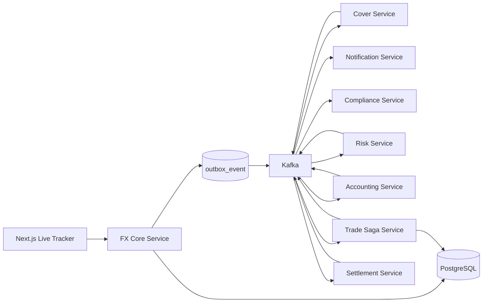

# FX Trading Sample

FX トレーディングを題材に、`ACID + Saga` ハイブリッドアーキテクチャを `Spring Boot + Apache Camel 4 + Kafka + PostgreSQL + Next.js` で実装したサンプルです。

このリポジトリでは、以下を確認できます。

- 約定コアを単一サービス内の ACID トランザクションで確定する実装
- 後続業務を Kafka + Saga で非同期連携する実装
- Outbox による送信保証と Consumer 側冪等
- 補償をロールバックではなく業務的打消しで表現する実装
- UI から実際にリクエストを送り、各サービスの動作をライブ追跡するトラッカー

## 構成

- `backend/`: Maven マルチモジュール構成のバックエンド
- `frontend/`: Next.js ベースのライブトレース UI
- `design/design.md`: 元の設計書
- `design/coding-standards.md`: コーディング基準
- `design/implementation-guide.md`: 実装概要、トランザクション詳細、実装アーキテクチャ、実装詳細

## 全体像



## クイックスタート

### 1. バックエンドをビルド

```bash
cd backend
mvn -DskipTests package
```

### 2. Podman で起動

```bash
cd backend
podman compose -f compose.yaml up -d --build
```

### 3. フロントエンドを起動

```bash
cd frontend
npm install
npm run dev
```

### 4. ブラウザで確認

- UI: `http://localhost:3000`
- FX Core API: `http://localhost:8080/api/trades`

### コンテナ化したフロントエンドを使う場合

`podman compose` で `frontend` も含めて起動した場合の UI は以下です。

- UI(Container): `http://localhost:3400`

## ライブトレース UI

フロントエンドは、単なるシナリオ再生ではありません。

- UI から `POST /api/trades` を実行
- 返却された `tradeId` を保持
- `GET /api/trades/{tradeId}/trace` をポーリング
- `trade_saga`、`outbox_event`、`trade_activity` を組み合わせて表示

表示できる内容:

- ACID 確定後の取引状態
- Saga 全体の状態
- 各マイクロサービスの状態
- Outbox イベントの送信状況
- 各サービスが実際に実行した活動履歴
- 補償が発生した場合の打消しフロー

## テスト

### バックエンド結合テスト

```bash
cd backend
mvn -pl integration-tests -am test
```

このテストでは、Kafka / PostgreSQL 付きで全サービスを起動し、以下を検証します。

- `TradeExecuted -> Saga COMPLETED`
- `CoverTradeFailed -> 補償 -> Saga CANCELLED`

### フロントエンド検証

```bash
cd frontend
npm run lint
npm run build
```

## OpenShift デプロイ

OpenShift 向けマニフェストは `openshift/` にあります。`oc apply -f` で適用できるように作成してあります。

### 1. バックエンド JAR をビルド

```bash
cd backend
mvn -DskipTests package
```

### 2. フロントエンドをビルド確認

```bash
cd frontend
npm install
npm run build
```

### 3. OpenShift プロジェクトを作成

```bash
oc apply -f openshift/project.yaml
oc project fx-trading-sample
```

### 4. OpenShift 内蔵レジストリへイメージを push

```bash
REGISTRY="$(oc registry info --public)"
NAMESPACE="fx-trading-sample"
USER_NAME="$(oc whoami)"
TOKEN="$(oc whoami -t)"

podman login "$REGISTRY" -u "$USER_NAME" -p "$TOKEN" --tls-verify=false

for image in fx-core-service trade-saga-service cover-service risk-service accounting-service settlement-service notification-service compliance-service frontend; do
  podman tag "backend-${image}:latest" "$REGISTRY/$NAMESPACE/${image}:latest"
  podman push --tls-verify=false "$REGISTRY/$NAMESPACE/${image}:latest"
done
```

### 5. OpenShift マニフェストを適用

```bash
oc apply -f openshift/fx-trading-stack.yaml
```

### 6. Observability スタックを適用

```bash
oc apply -f openshift/observability-stack.yaml
```

### 7. 状態確認

```bash
oc get pods
oc get svc
oc get routes
```

### 8. アクセス確認

`frontend` Route の URL を開きます。

```bash
oc get route fx-frontend
```

Observability の Route は以下です。

```bash
oc get route fx-grafana
oc get route fx-prometheus
```

Grafana 初期ログイン:

- User: `admin`
- Password: `admin123`

補足:

- 現在のマニフェストは PoC 用の単一ノード構成です。
- PostgreSQL と Kafka は OpenShift 上でも同梱デプロイします。
- アプリケーションイメージ参照先は `fx-trading-sample` プロジェクトの内蔵レジストリです。
- 他の namespace に展開する場合は、`openshift/fx-trading-stack.yaml` 内の image パスを該当 namespace に変更してください。

## Observability

OpenShift 向けに以下を実装しています。

- `Prometheus`: 各サービスの `/actuator/prometheus` を scrape
- `Tempo`: OTLP でトレースを受信
- `Loki`: アプリログを集約
- `Grafana`: Prometheus / Loki / Tempo の datasources を自動登録
- `FX Trading Overview` ダッシュボード: 取引数、Saga 完了/取消、補償開始、Outbox 配送、HTTP リクエスト、JVM Heap、アプリログ

## Load Test

負荷試験用スクリプトは `loadtest/` にあります。

- `loadtest/k6-trade-stress.js`
- `loadtest/k6-1000-accounts-stress.js`
- `loadtest/run_replica_comparison.py`
- `loadtest/trade-request.json`
- `loadtest/README.md`

`run_replica_comparison.py` は、`fx-trading-sample` namespace を対象にレプリカ数を切り替えながら `hey` と Prometheus 指標をまとめて採取します。

### Grafana ダッシュボードで見られるもの

- `fx_trade_submitted_total`
- `fx_saga_completed_total`
- `fx_saga_cancelled_total`
- `fx_compensation_started_total`
- `fx_outbox_enqueued_total`
- `fx_outbox_sent_total`
- `fx_outbox_failed_total`
- `http_server_requests_seconds_count`
- `jvm_memory_used_bytes`
- Loki 上のアプリログ

### OpenShift へ observability を反映する際の流れ

アプリに observability 依存と設定を入れた後は、イメージを再 build / push してから manifest を適用します。

```bash
cd backend
mvn -DskipTests package

cd ../frontend
npm install
npm run build

cd ..
oc project fx-trading-sample

REGISTRY="$(oc registry info --public)"
NAMESPACE="fx-trading-sample"
USER_NAME="$(oc whoami)"
TOKEN="$(oc whoami -t)"

podman login "$REGISTRY" -u "$USER_NAME" -p "$TOKEN" --tls-verify=false
```

アプリイメージ push の後に以下を適用します。

```bash
oc apply -f openshift/fx-trading-stack.yaml
oc apply -f openshift/observability-stack.yaml
```

## 実装方針

- 約定コアは同期・強整合
- 後続業務は非同期・最終的整合
- 送信保証は Outbox
- 重複耐性は Consumer 側冪等
- Camel 4 の EIP / Component を優先利用
- 業務判断・状態遷移・補償判定は Service 層で管理

## ドキュメント

詳細は `design/implementation-guide.md` を参照してください。

- 処理概要
- トランザクションの詳細
- 実装アーキテクチャ
- 実装の詳細
- Mermaid 図
