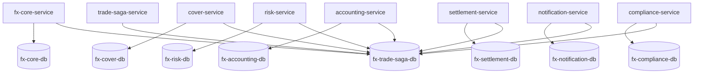
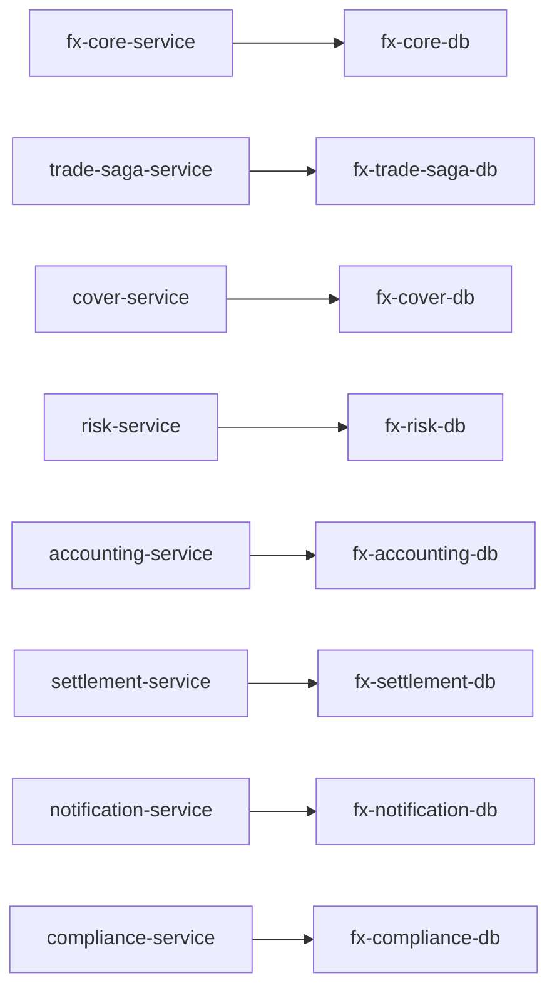

# サービスごと DB 分離リファクタ設計案

## 目的

現在の PoC は、複数サービスが実質 1 つの PostgreSQL に集約しており、

- ACID 領域の同期書き込み
- Saga 状態更新
- 後続サービスのローカル更新
- Outbox
- 活動履歴

が同じ DB へ集中しています。

本設計案では、**サービスごとに書き込み責務を分離し、単一 PostgreSQL への集中を緩和**することを目的とします。

## 分離方針

### フェーズ1

- `fx-core-service` 専用 DB
- `trade-saga-service` 専用 DB
- `cover-service` 専用 DB
- `risk-service` 専用 DB
- `accounting-service` 専用 DB
- `settlement-service` 専用 DB
- `notification-service` 専用 DB
- `compliance-service` 専用 DB

### 共有ポリシー

- 各サービスは自分のローカルテーブル、`processed_message`、`outbox_event` を自分の DB に持つ
- `trade_activity` は `trade-saga-service` の DB に集約する
- `fx-core-service` の trace API は
  - Core DB から取引本体 / 残高 / core outbox
  - Saga DB から `trade_saga` / `trade_activity`
  を読む

## サービスと DB の対応

## テーブル配置

### fx-core-db

- `trade_order`
- `trade_execution`
- `account_balance`
- `balance_hold`
- `fx_position`
- `outbox_event`

### fx-trade-saga-db

- `trade_saga`
- `trade_activity`
- `processed_message`
- `outbox_event`

### 各後続サービス DB

共通:

- `processed_message`
- `outbox_event`

個別:

- `fx-cover-db`: `cover_trade`
- `fx-risk-db`: `risk_record`
- `fx-accounting-db`: `accounting_entry`
- `fx-settlement-db`: `settlement_record`
- `fx-notification-db`: `notification_record`
- `fx-compliance-db`: `compliance_record`

## アプリケーション変更方針

### 1. ローカル DB

各サービスの既定 `spring.datasource` をそのサービス専用 DB に向ける。

### 2. activity DB

`trade_activity` は全サービスから Saga DB に書く。

- `activity.db.url`
- `activity.db.username`
- `activity.db.password`

を追加し、`TradeActivitySupport` はこれを優先利用する。

### 3. saga query DB

`fx-core-service` の trace API は Saga DB を読むため、

- `saga.db.url`
- `saga.db.username`
- `saga.db.password`

を追加し、`TradeTraceQueryService` は Saga DB を参照する。

## OpenShift manifest 変更案

### 変更ポイント

- PostgreSQL を 8 deployment / service に分離
- すべて同じ `fx-postgres` ベースイメージを使う
- 各 DB に同じ init SQL を流す
- 各 service deployment の `DB_HOST` を個別 DB へ変更
- `activity.db.*` は Saga DB を向ける
- `fx-core-service` に `saga.db.*` を追加

### 変更後イメージ

## 期待効果

- `fx-core-service` の同期 ACID 領域から後続サービス書き込みを分離
- `trade_saga` 更新が Core DB と競合しなくなる
- 1000 アカウント集中時の DB ホットスポット以外の競合を緩和
- 後続サービスの負荷増加が Core DB に波及しにくくなる

## 想定リスク

- DB 数増加による Pod / 運用コスト増加
- trace API が複数 DB 参照になる
- `trade_activity` の書き込み先が分離されるため、Saga DB の可用性がより重要になる

## 再試験方針

DB 分離後は、以下を再実施する。

1. `1000アカウント集中`
2. `毎回ユニークアカウント`
3. `1 / 3 / 5 replicas`
4. Kafka `3 broker`

比較観点:

- `Requests/sec`
- `Average latency`
- `Kafka lag max`
- `Outbox backlog max`
- `trade_saga duration`
- `Pod CPU / Memory`
- DB lock wait / transaction duration
