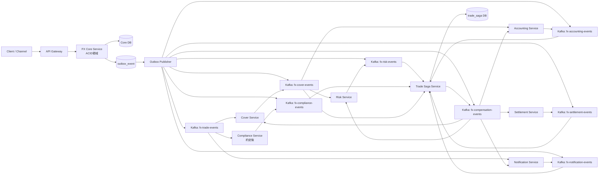
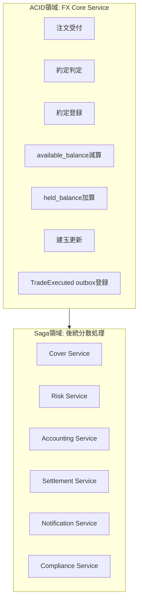
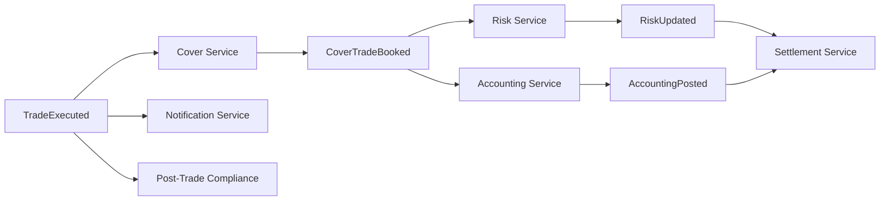
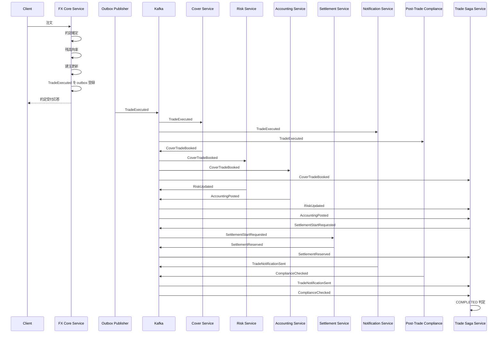
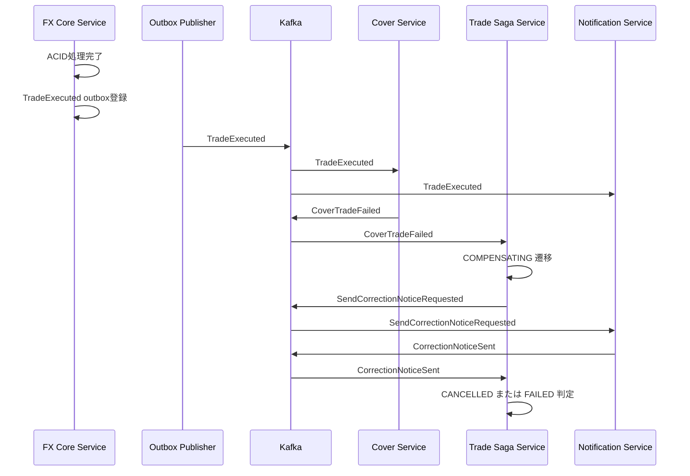
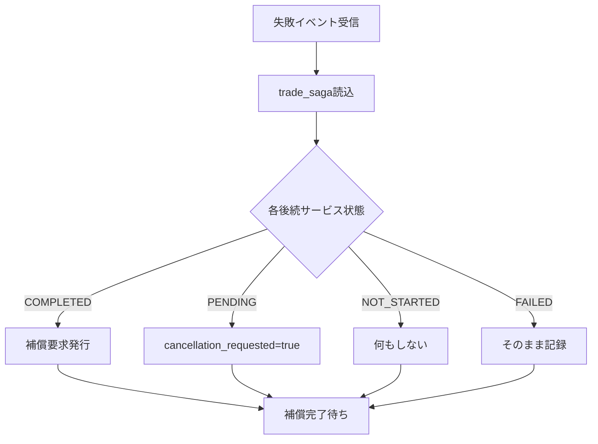
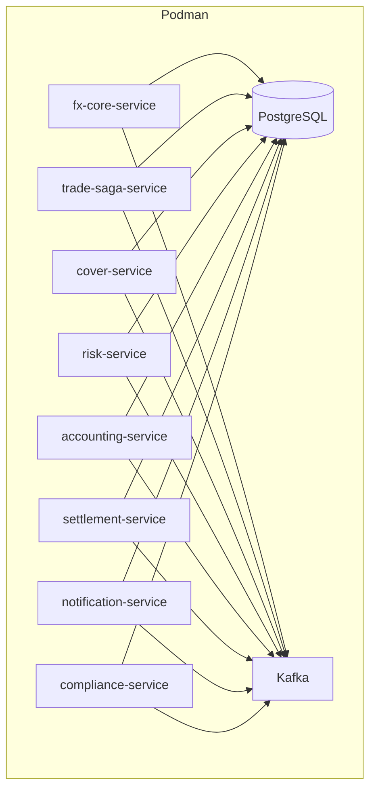

# FXトレーディングサンプル設計書

## ACID + Saga ハイブリッドアーキテクチャ

### 前提

* JDK 21
* `org/apache/camel/archetypes/camel-archetype-spring-boot/4.14.4.redhat-00010`
* Spring Boot + Apache Camel
* Kafka
* RDB
* Podman 利用
* Camelルートは **Java DSL**
* PoC対象。部分約定は**対象外**とし、**1注文=1約定**を前提とする

---

# 1. 目的

本設計は、FXトレーディングにおいて、

* **約定確定**
* **残高拘束**
* **建玉更新**

を **単一サービス内の ACID トランザクション** で処理し、

* **カバー取引**
* **リスク反映**
* **会計仕訳**
* **受渡予約**
* **通知**
* **約定後コンプライアンス**

を **Saga パターン** で連携するリファレンス実装を示すものである。

---

# 2. 設計方針

## 2.1 基本方針

1. **約定コアは同期・強整合**
2. **後続業務は非同期・最終的整合**
3. **送信保証は Outbox**
4. **重複耐性は Consumer 側冪等**
5. **補償はロールバックではなく逆取引 / 打消し**
6. **Trade Saga Service が進行状態と補償範囲を管理**

---

# 3. 適用範囲

## 3.1 ACID領域

* 注文受付
* 約定確定
* 約定登録
* 利用可能残高減算 / 拘束残高加算
* 建玉更新
* `TradeExecuted` Outbox 登録

## 3.2 Saga領域

* カバー取引
* リスク反映
* 会計仕訳
* 受渡予約
* 顧客通知
* 約定後コンプライアンス

## 3.3 対象外

* 部分約定
* ストリーミング価格配信
* 高頻度トレード最適化
* 実市場接続の詳細プロトコル
* 24時間監視・運用Runbook詳細

---

# 4. 全体アーキテクチャ



---

# 5. ACID / Saga 境界の明示



---

# 6. 後続処理の依存関係

レビュー指摘を踏まえ、後続処理は**完全並列ではない**。
以下の依存関係を採用する。

## 6.1 依存グラフ

* `TradeExecuted`

  * → `Cover Service`
  * → `Notification Service`
  * → `Post-Trade Compliance Service`

* `CoverTradeBooked`

  * → `Risk Service`
  * → `Accounting Service`

* `RiskUpdated` **かつ** `AccountingPosted`

  * → `Settlement Service`

つまり、カバー結果を必要とする業務は `TradeExecuted` 直後には起動しない。



## 6.2 設計理由

* 会計はカバー約定結果を参照する前提
* リスクもカバー結果を反映する前提
* 通知は取引本体と独立させる
* 約定後コンプライアンスは非致命 / 条件付き致命と切り分ける

---

# 7. コンプライアンスの分離

## 7.1 約定前コンプライアンス（同期）

FX Core Service 内で同期実施する。

対象例:

* KYC未完了口座
* 制裁対象口座
* 取引禁止属性
* 取引上限超過の事前判定

失敗時:

* 約定拒否
* ACID領域に入らない

## 7.2 約定後コンプライアンス（非同期）

Saga 領域で実施する。

対象例:

* モニタリング
* 疑わしい取引パターン検知
* 事後審査
* レポート連携

失敗時:

* 原則 `FAILED` または `REVIEW_PENDING`
* 要件次第で補償トリガー

---

# 8. 正常系シーケンス



---

# 9. 異常系シーケンス（カバー失敗）



---

# 10. 補償開始条件と範囲判定

レビュー指摘を踏まえ、補償は「失敗したら全部戻す」ではなく、
**`trade_saga` の各状態を見て補償対象を限定**する。

## 10.1 `trade_saga` の状態値

各サービスの状態は以下を取る。

* `NOT_STARTED`
* `PENDING`
* `COMPLETED`
* `FAILED`
* `COMPENSATING`
* `COMPENSATED`
* `SKIPPED`

## 10.2 補償開始条件

以下のいずれかで `trade_saga.saga_status = COMPENSATING` とする。

* `CoverTradeFailed`
* `RiskUpdateFailed`
* `AccountingPostFailed`
* `SettlementReserveFailed`
* 約定後コンプライアンスの致命失敗

## 10.3 補償範囲判定ルール

Trade Saga Service は補償開始時に以下を行う。

1. `trade_saga` を読み込む
2. `COMPLETED` のサービスのみ補償要求を発行
3. `NOT_STARTED` / `SKIPPED` には何もしない
4. `PENDING` のサービスには **cancellation_requested フラグ** を設定
5. `PENDING` のサービスは完了時にフラグを確認し、自分で補償イベントを発行するか結果を無効化する

## 10.4 補償ロジック要約

* **成功済みだけ戻す**
* **未着手は起動しない**
* **処理中は抑止 / 自己補償**



---

# 11. FX Core Service の排他制御

レビュー指摘どおり、二重約定防止を明示する。

## 11.1 採用方式

以下を組み合わせる。

1. `trade_order.version_no` による **楽観ロック**
2. `trade_execution.order_id` に **ユニーク制約**
3. 必要に応じて `trade_order` 取得時に `SELECT ... FOR UPDATE`

## 11.2 ルール

* 同一 `order_id` に対して約定確定は1回のみ
* `order_status = NEW` → `EXECUTING` → `EXECUTED`
* `trade_execution` に同一 `order_id` が既に存在すれば重複約定とみなす

## 11.3 推奨DDL

```sql
ALTER TABLE trade_execution
ADD CONSTRAINT uk_trade_execution_order UNIQUE (order_id);
```

---

# 12. データモデル

## 12.1 `trade_order`

```sql
CREATE TABLE trade_order (
    order_id             VARCHAR(64) PRIMARY KEY,
    account_id           VARCHAR(64) NOT NULL,
    currency_pair        VARCHAR(16) NOT NULL,
    side                 VARCHAR(8) NOT NULL,
    order_type           VARCHAR(16) NOT NULL,
    order_amount         DECIMAL(18,2) NOT NULL,
    order_status         VARCHAR(32) NOT NULL,
    created_at           TIMESTAMP NOT NULL,
    updated_at           TIMESTAMP NOT NULL,
    version_no           INTEGER NOT NULL DEFAULT 0
);
```

## 12.2 `trade_execution`

レビュー指摘どおり `version_no` を追加する。

```sql
CREATE TABLE trade_execution (
    trade_id             VARCHAR(64) PRIMARY KEY,
    order_id             VARCHAR(64) NOT NULL,
    account_id           VARCHAR(64) NOT NULL,
    currency_pair        VARCHAR(16) NOT NULL,
    side                 VARCHAR(8) NOT NULL,
    executed_price       DECIMAL(18,8) NOT NULL,
    executed_amount      DECIMAL(18,2) NOT NULL,
    execution_status     VARCHAR(32) NOT NULL,
    executed_at          TIMESTAMP NOT NULL,
    version_no           INTEGER NOT NULL DEFAULT 0,
    CONSTRAINT uk_trade_execution_order UNIQUE (order_id)
);
```

## 12.3 `account_balance`

レビュー指摘を反映し追加する。

```sql
CREATE TABLE account_balance (
    account_id           VARCHAR(64) NOT NULL,
    currency             VARCHAR(3)  NOT NULL,
    available_balance    DECIMAL(18,2) NOT NULL,
    held_balance         DECIMAL(18,2) NOT NULL,
    updated_at           TIMESTAMP NOT NULL,
    version_no           INTEGER NOT NULL DEFAULT 0,
    PRIMARY KEY (account_id, currency)
);
```

## 12.4 `balance_hold`

```sql
CREATE TABLE balance_hold (
    hold_id              VARCHAR(64) PRIMARY KEY,
    trade_id             VARCHAR(64) NOT NULL,
    account_id           VARCHAR(64) NOT NULL,
    hold_amount          DECIMAL(18,2) NOT NULL,
    hold_status          VARCHAR(32) NOT NULL,
    created_at           TIMESTAMP NOT NULL,
    updated_at           TIMESTAMP NOT NULL
);
```

## 12.5 `fx_position`

```sql
CREATE TABLE fx_position (
    position_id          VARCHAR(64) PRIMARY KEY,
    account_id           VARCHAR(64) NOT NULL,
    currency_pair        VARCHAR(16) NOT NULL,
    net_amount           DECIMAL(18,2) NOT NULL,
    average_price        DECIMAL(18,8) NOT NULL,
    updated_at           TIMESTAMP NOT NULL,
    version_no           INTEGER NOT NULL DEFAULT 0
);
```

## 12.6 `trade_saga`

```sql
CREATE TABLE trade_saga (
    trade_id                 VARCHAR(64) PRIMARY KEY,
    order_id                 VARCHAR(64) NOT NULL,
    saga_status              VARCHAR(32) NOT NULL,
    cover_status             VARCHAR(32) NOT NULL,
    risk_status              VARCHAR(32) NOT NULL,
    accounting_status        VARCHAR(32) NOT NULL,
    settlement_status        VARCHAR(32) NOT NULL,
    notification_status      VARCHAR(32) NOT NULL,
    compliance_status        VARCHAR(32) NOT NULL,
    cover_cancel_requested   BOOLEAN NOT NULL DEFAULT FALSE,
    risk_cancel_requested    BOOLEAN NOT NULL DEFAULT FALSE,
    accounting_cancel_requested BOOLEAN NOT NULL DEFAULT FALSE,
    settlement_cancel_requested BOOLEAN NOT NULL DEFAULT FALSE,
    correlation_id           VARCHAR(128) NOT NULL,
    created_at               TIMESTAMP NOT NULL,
    updated_at               TIMESTAMP NOT NULL,
    version_no               INTEGER NOT NULL DEFAULT 0
);
```

---

# 13. Outbox / 冪等

## 13.1 `outbox_event`

```sql
CREATE TABLE outbox_event (
    event_id               VARCHAR(64) PRIMARY KEY,
    aggregate_type         VARCHAR(64) NOT NULL,
    aggregate_id           VARCHAR(64) NOT NULL,
    event_type             VARCHAR(64) NOT NULL,
    topic_name             VARCHAR(128) NOT NULL,
    message_key            VARCHAR(128) NOT NULL,
    payload                CLOB NOT NULL,
    status                 VARCHAR(16) NOT NULL,
    retry_count            INTEGER NOT NULL DEFAULT 0,
    next_retry_at          TIMESTAMP NULL,
    correlation_id         VARCHAR(128) NOT NULL,
    source_service         VARCHAR(64) NOT NULL,
    created_at             TIMESTAMP NOT NULL,
    sent_at                TIMESTAMP NULL,
    last_error_message     VARCHAR(1024),
    version_no             INTEGER NOT NULL DEFAULT 0
);
```

## 13.2 `processed_message`

```sql
CREATE TABLE processed_message (
    consumer_name          VARCHAR(64) NOT NULL,
    event_id               VARCHAR(64) NOT NULL,
    processed_at           TIMESTAMP NOT NULL,
    PRIMARY KEY (consumer_name, event_id)
);
```

---

# 14. イベント一覧

## 14.1 起点イベント

* `TradeExecuted`

## 14.2 後続成功イベント

* `CoverTradeBooked`
* `RiskUpdated`
* `AccountingPosted`
* `SettlementReserved`
* `TradeNotificationSent`
* `ComplianceChecked`

## 14.3 後続失敗イベント

* `CoverTradeFailed`
* `RiskUpdateFailed`
* `AccountingPostFailed`
* `SettlementReserveFailed`
* `ComplianceCheckFailed`
* `TradeNotificationFailed`（非致命）

## 14.4 補償要求イベント

* `ReverseCoverTradeRequested`
* `ReverseRiskRequested`
* `ReverseAccountingRequested`
* `CancelSettlementRequested`
* `SendCorrectionNoticeRequested`

## 14.5 補償完了イベント

* `CoverTradeReversed`
* `RiskReversed`
* `AccountingReversed`
* `SettlementCancelled`
* `CorrectionNoticeSent`

---

# 15. イベント / トピック経路マトリクス

レビュー指摘を踏まえ、どのイベントがどのトピックを通るかを明示する。

| イベント                          | 発行元                  | トピック                     | 受信先                                        |
| ----------------------------- | -------------------- | ------------------------ | ------------------------------------------ |
| TradeExecuted                 | FX Core Service      | `fx-trade-events`        | Cover, Notification, Post-Trade Compliance |
| CoverTradeBooked              | Cover Service        | `fx-cover-events`        | Risk, Accounting, Trade Saga               |
| CoverTradeFailed              | Cover Service        | `fx-cover-events`        | Trade Saga                                 |
| RiskUpdated                   | Risk Service         | `fx-risk-events`         | Trade Saga                                 |
| RiskUpdateFailed              | Risk Service         | `fx-risk-events`         | Trade Saga                                 |
| AccountingPosted              | Accounting Service   | `fx-accounting-events`   | Trade Saga                                 |
| AccountingPostFailed          | Accounting Service   | `fx-accounting-events`   | Trade Saga                                 |
| SettlementStartRequested      | Trade Saga Service   | `fx-settlement-events`   | Settlement                                 |
| SettlementReserved            | Settlement Service   | `fx-settlement-events`   | Trade Saga                                 |
| SettlementReserveFailed       | Settlement Service   | `fx-settlement-events`   | Trade Saga                                 |
| TradeNotificationSent         | Notification Service | `fx-notification-events` | Trade Saga                                 |
| TradeNotificationFailed       | Notification Service | `fx-notification-events` | Trade Saga                                 |
| ComplianceChecked             | Compliance Service   | `fx-compliance-events`   | Trade Saga                                 |
| ComplianceCheckFailed         | Compliance Service   | `fx-compliance-events`   | Trade Saga                                 |
| ReverseCoverTradeRequested    | Trade Saga Service   | `fx-compensation-events` | Cover                                      |
| ReverseRiskRequested          | Trade Saga Service   | `fx-compensation-events` | Risk                                       |
| ReverseAccountingRequested    | Trade Saga Service   | `fx-compensation-events` | Accounting                                 |
| CancelSettlementRequested     | Trade Saga Service   | `fx-compensation-events` | Settlement                                 |
| SendCorrectionNoticeRequested | Trade Saga Service   | `fx-compensation-events` | Notification                               |
| CoverTradeReversed            | Cover Service        | `fx-cover-events`        | Trade Saga                                 |
| RiskReversed                  | Risk Service         | `fx-risk-events`         | Trade Saga                                 |
| AccountingReversed            | Accounting Service   | `fx-accounting-events`   | Trade Saga                                 |
| SettlementCancelled           | Settlement Service   | `fx-settlement-events`   | Trade Saga                                 |
| CorrectionNoticeSent          | Notification Service | `fx-notification-events` | Trade Saga                                 |

補償要求イベントは **`fx-compensation-events` に統一**する。

---

# 16. Podman 前提の実行構成

PoCでは Podman を用い、以下をコンテナで起動する。

* Kafka
* RDB
* FX Core Service
* Trade Saga Service
* Cover Service
* Risk Service
* Accounting Service
* Settlement Service
* Notification Service
* Compliance Service



---

# 17. Java DSL 設計方針

## 17.1 Camel の責務

* Kafka 入出力
* イベント種別での分岐
* Bean 呼び出し
* Outbox Publisher
* 再送入口

## 17.2 Java Service の責務

* 業務判定
* DB更新
* 補償対象判定
* 状態遷移
* 冪等記録

---

# 18. Java DSL サンプル

## 18.1 Outbox Publisher

```java
@Component
public class OutboxPublisherRoute extends RouteBuilder {

    @Override
    public void configure() {

        from("timer:coreOutboxPoller?fixedRate=true&period={{outbox.poll.period.ms:100}}")
            .routeId("core-outbox-poller")
            .to("sql:select event_id from outbox_event "
                + "where status in ('NEW','RETRY') "
                + "and (next_retry_at is null or next_retry_at <= current_timestamp) "
                + "order by created_at "
                + "fetch first {{outbox.max.rows:100}} rows only"
                + "?dataSource=#dataSource&outputType=SelectList")
            .split(body())
                .to("direct:publishOutboxEvent")
            .end();

        from("direct:publishOutboxEvent")
            .routeId("publish-outbox-event")
            .setHeader("eventId", simple("${body[event_id]}"))
            .bean("outboxClaimService", "claim(${header.eventId})")
            .choice()
                .when(body().isEqualTo(true))
                    .bean("outboxQueryService", "findById(${header.eventId})")
                    .setHeader("kafka.KEY", simple("${body[message_key]}"))
                    .setHeader("eventType", simple("${body[event_type]}"))
                    .setHeader("topicName", simple("${body[topic_name]}"))
                    .setBody(simple("${body[payload]}"))
                    .doTry()
                        .toD("kafka:${header.topicName}?brokers={{kafka.bootstrap.servers}}&requestRequiredAcks=all")
                        .bean("outboxStatusService", "markSent(${header.eventId})")
                    .doCatch(Exception.class)
                        .bean("outboxStatusService", "markFailed(${header.eventId}, ${exception.message})")
                    .end()
                .otherwise()
                    .log("Skip already claimed eventId=${header.eventId}")
            .end();
    }
}
```

レビュー指摘の通り、`topic_name` は **payload 化する前にヘッダへ退避**して使う。

---

## 18.2 Cover Service Consumer

```java
@Component
public class CoverConsumerRoute extends RouteBuilder {

    @Override
    public void configure() {

        from("kafka:fx-trade-events?brokers={{kafka.bootstrap.servers}}&groupId=cover-service")
            .routeId("cover-consume-trade-events")
            .choice()
                .when(header("eventType").isEqualTo("TradeExecuted"))
                    .to("direct:bookCoverTrade")
            .end();

        from("kafka:fx-compensation-events?brokers={{kafka.bootstrap.servers}}&groupId=cover-service-comp")
            .routeId("cover-consume-compensation-events")
            .choice()
                .when(header("eventType").isEqualTo("ReverseCoverTradeRequested"))
                    .to("direct:reverseCoverTrade")
            .end();

        from("direct:bookCoverTrade")
            .routeId("book-cover-trade")
            .unmarshal().json()
            .bean("duplicateMessageService", "isDuplicate(${header.eventId}, 'cover-service')")
            .choice()
                .when(body().isEqualTo(true))
                    .log("Duplicate event ignored eventId=${header.eventId}")
                .otherwise()
                    .bean("coverSagaService", "bookCoverTrade")
            .end();

        from("direct:reverseCoverTrade")
            .routeId("reverse-cover-trade")
            .unmarshal().json()
            .bean("coverSagaService", "reverseCoverTrade");
    }
}
```

---

## 18.3 Trade Saga Consumer

```java
@Component
public class TradeSagaRoute extends RouteBuilder {

    @Override
    public void configure() {

        from("kafka:fx-cover-events?brokers={{kafka.bootstrap.servers}}&groupId=trade-saga-service")
            .routeId("trade-saga-cover-events")
            .to("direct:handleTradeSagaEvent");

        from("kafka:fx-risk-events?brokers={{kafka.bootstrap.servers}}&groupId=trade-saga-service")
            .routeId("trade-saga-risk-events")
            .to("direct:handleTradeSagaEvent");

        from("kafka:fx-accounting-events?brokers={{kafka.bootstrap.servers}}&groupId=trade-saga-service")
            .routeId("trade-saga-accounting-events")
            .to("direct:handleTradeSagaEvent");

        from("kafka:fx-settlement-events?brokers={{kafka.bootstrap.servers}}&groupId=trade-saga-service")
            .routeId("trade-saga-settlement-events")
            .to("direct:handleTradeSagaEvent");

        from("kafka:fx-notification-events?brokers={{kafka.bootstrap.servers}}&groupId=trade-saga-service")
            .routeId("trade-saga-notification-events")
            .to("direct:handleTradeSagaEvent");

        from("kafka:fx-compliance-events?brokers={{kafka.bootstrap.servers}}&groupId=trade-saga-service")
            .routeId("trade-saga-compliance-events")
            .to("direct:handleTradeSagaEvent");

        from("direct:handleTradeSagaEvent")
            .routeId("trade-saga-handle-event")
            .unmarshal().json()
            .choice()
                .when(header("eventType").isEqualTo("CoverTradeBooked"))
                    .bean("tradeSagaService", "onCoverTradeBooked")
                .when(header("eventType").isEqualTo("CoverTradeFailed"))
                    .bean("tradeSagaService", "onCoverTradeFailed")
                .when(header("eventType").isEqualTo("RiskUpdated"))
                    .bean("tradeSagaService", "onRiskUpdated")
                .when(header("eventType").isEqualTo("RiskUpdateFailed"))
                    .bean("tradeSagaService", "onRiskUpdateFailed")
                .when(header("eventType").isEqualTo("AccountingPosted"))
                    .bean("tradeSagaService", "onAccountingPosted")
                .when(header("eventType").isEqualTo("AccountingPostFailed"))
                    .bean("tradeSagaService", "onAccountingPostFailed")
                .when(header("eventType").isEqualTo("SettlementReserved"))
                    .bean("tradeSagaService", "onSettlementReserved")
                .when(header("eventType").isEqualTo("SettlementReserveFailed"))
                    .bean("tradeSagaService", "onSettlementReserveFailed")
                .when(header("eventType").isEqualTo("TradeNotificationSent"))
                    .bean("tradeSagaService", "onTradeNotificationSent")
                .when(header("eventType").isEqualTo("TradeNotificationFailed"))
                    .bean("tradeSagaService", "onTradeNotificationFailed")
                .when(header("eventType").isEqualTo("ComplianceChecked"))
                    .bean("tradeSagaService", "onComplianceChecked")
                .when(header("eventType").isEqualTo("ComplianceCheckFailed"))
                    .bean("tradeSagaService", "onComplianceCheckFailed")
                .when(header("eventType").isEqualTo("CoverTradeReversed"))
                    .bean("tradeSagaService", "onCoverTradeReversed")
                .when(header("eventType").isEqualTo("RiskReversed"))
                    .bean("tradeSagaService", "onRiskReversed")
                .when(header("eventType").isEqualTo("AccountingReversed"))
                    .bean("tradeSagaService", "onAccountingReversed")
                .when(header("eventType").isEqualTo("SettlementCancelled"))
                    .bean("tradeSagaService", "onSettlementCancelled")
                .when(header("eventType").isEqualTo("CorrectionNoticeSent"))
                    .bean("tradeSagaService", "onCorrectionNoticeSent")
            .end();
    }
}
```

---

# 19. FX Core Service のACID処理

## 19.1 1トランザクション内の処理順

1. 約定前コンプライアンスチェック
2. `trade_order` を排他取得
3. 二重約定防止チェック
4. `trade_execution` 登録
5. `account_balance.available_balance` 減算
6. `account_balance.held_balance` 加算
7. `balance_hold` 登録
8. `fx_position` 更新
9. `trade_saga` 初期登録
10. `outbox_event` に `TradeExecuted` 登録
11. commit

## 19.2 理由

* 約定と資産拘束の不整合を防ぐため
* `trade_saga` 初期状態も同一Txで作成し、後続が追跡対象を失わないようにする

---

# 20. Outbox 発行方式の注記

## 20.1 PoC採用方式

* Timer ポーリング
* 目標値: `100ms` 程度まで短縮可能

## 20.2 制約

* ポーリングである以上、約定→後続開始に待ち時間が入る
* FXの本番要件によっては遅い可能性がある

## 20.3 本番候補

* Debezium CDC
* PostgreSQL LISTEN/NOTIFY
* DBイベント駆動

PoCでは Timer ポーリングを採用しつつ、**本番ではPush型を推奨**と明記する。

---

# 21. 致命 / 非致命の分類

## 21.1 致命失敗

* `CoverTradeFailed`
* `RiskUpdateFailed`
* `AccountingPostFailed`
* `SettlementReserveFailed`
* 約定後コンプライアンスの致命失敗

## 21.2 非致命失敗

* `TradeNotificationFailed`
* レポート出力失敗
* 監査ログ転送失敗

通知失敗では取引本体を巻き戻さない。

---

# 22. 補償方針

| 元処理   | 補償   |
| ----- | ---- |
| カバー取引 | 反対売買 |
| リスク更新 | 反転更新 |
| 会計仕訳  | 取消仕訳 |
| 受渡予約  | 予約取消 |
| 通知    | 訂正通知 |

ロールバックではなく**業務的打消し**を採用する。

---

# 23. 実装標準

## 23.1 Java

* JDK 21
* Spring Boot + Camel 4.14.4.redhat-00010
* 業務ロジックは Service 層
* Camel は配線責務に限定

## 23.2 Maven archetype

* `org/apache/camel/archetypes/camel-archetype-spring-boot/4.14.4.redhat-00010`

## 23.3 Podman

* 各サービスはコンテナ起動
* ローカルPoCでは podman compose を前提

---

# 24. テスト観点

## 24.1 正常系

* 約定 → カバー → リスク / 会計 → 受渡 → 完了

## 24.2 異常系

* カバー失敗 → 補償
* 会計失敗 → 補償
* 受渡失敗 → 補償
* 通知失敗 → 再送のみ

## 24.3 排他

* 同一注文の二重実行防止

## 24.4 冪等

* 同一 `eventId` の再受信で二重反映しない

## 24.5 Outbox

* Kafka送信失敗時 `RETRY`
* 規定回数超過で `ERROR`

---

# 25. 総括

本ブラッシュアップ版では、レビュー指摘に基づき、

* **後続処理の依存関係**
* **補償範囲の判定**
* **約定の排他**
* **イベント / トピック経路**
* **残高テーブル不足**
* **コンプライアンスの前後分離**
* **Java DSL化**
* **Podman / JDK21 / Camel 4.14.4.redhat-00010 前提**

を明確化した。

特に重要なのは、
**「ACIDで閉じるべき約定コア」と「Sagaで接続すべき後続分散処理」を維持したまま、並列Saga特有の補償判定と依存関係を設計に落とし込んだ点**である。

