非常に良い改善案です。
結論から言うと、今回の問題はまさにあなたの資料にある通り：

👉 **「Podを増やしても速くならない」構造的ボトルネック問題**です

特にこの資料のポイントは極めて重要です👇

* DB接続競合
* Kafka lag
* Saga / Outbox競合
  👉 **内部資源に圧力集中している** 

---

# ■ 設計再考の結論（重要）

今回の改善策を踏まえた最適解はこれです：

```text
スケールアウト中心 → ❌
構造的スケーリング → ✅
```

つまり

```text
「並列化する」ではなく
「競合を分解する」
```

---

# ■ 新アーキテクチャ（再設計）

以下に改善案を統合した **最終アーキテクチャ** を提示します。

---

# 1. 全体構造（最重要）

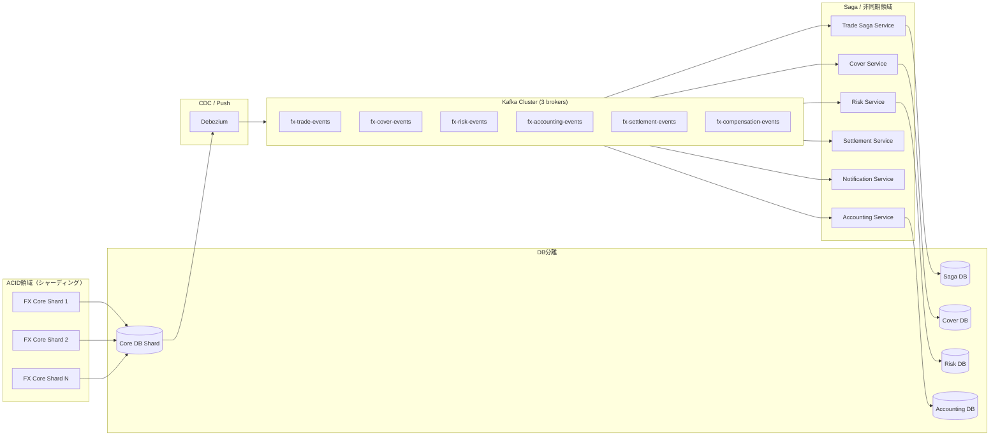

---

# ■ この設計の核心

## ✔ 1. ボトルネックを「分散」ではなく「分解」

資料の通り：

* DB接続爆発
* Kafka lag
* Outbox競合

👉 これは「並列数増加で悪化する」構造 

---

## ✔ 解決

```text
共有リソースを排除する
```

---

# 2. Kafka設計（重要改善）

## Before（問題）

```text
1 broker
1 partition
→ consumer詰まり
```

## After

```mermaid
flowchart LR
    subgraph Kafka Cluster
        B1[Broker1]
        B2[Broker2]
        B3[Broker3]
    end

    T1[fx-trade-events (6 partitions)]
    T2[fx-cover-events (6 partitions)]
    T3[fx-risk-events (4 partitions)]
    T4[fx-compensation-events (2 partitions)]
```

---

## 設計ポイント

### ① broker 3台

* fault tolerance
* I/O分散

### ② partition最適化

* trade系 → 高並列（6以上）
* compensation → 低並列（2）

👉 Kafkaはパーティション単位で並列化される ([InfoQ][1])

---

## ③ key設計（超重要）

```text
key = tradeId
```

👉 同一Sagaの順序保証

---

# 3. DB設計（最重要改善）

## Before（問題）

```text
1 PostgreSQL
→ lock競合
→ connection爆発
```

---

## After（分離）

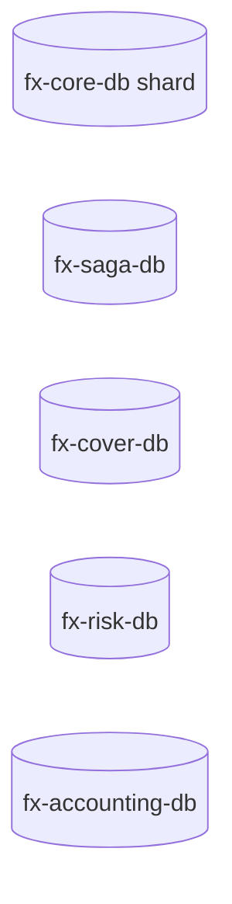

---

## ✔ 効果

* ロック競合分離
* I/O分離
* connection分散

---

# 4. ACID領域の進化

## 4.1 シャーディング導入

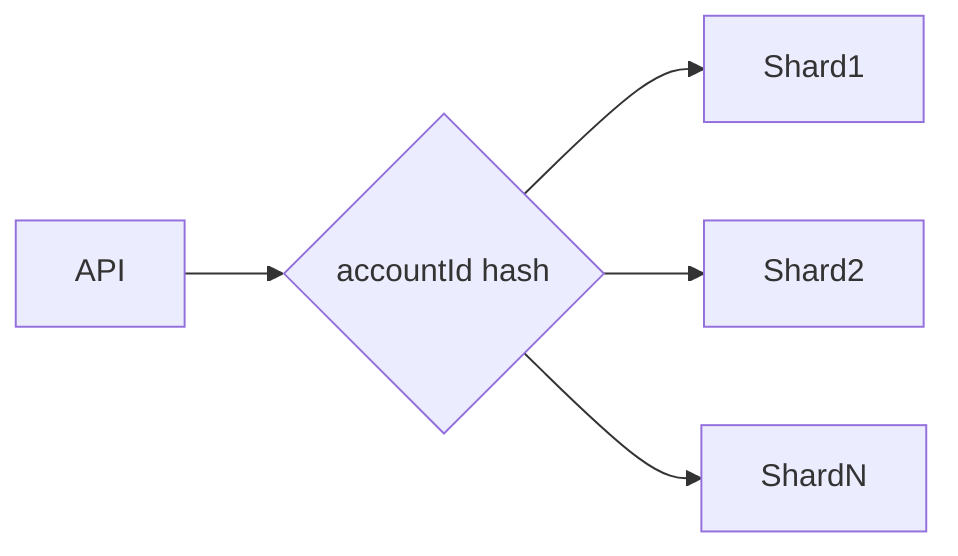

---

## ✔ 効果

```text
ホット口座問題の解消
```

---

# 4.2 残高バケット化（レビュー反映）

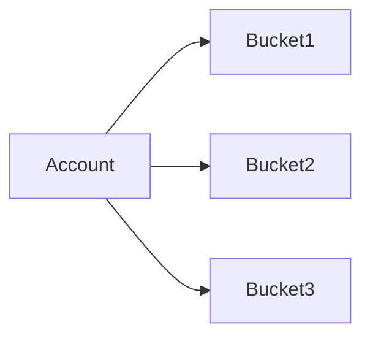

---

## ✔ 効果

```text
行ロック競合を分散
```

---

# 5. Outbox改善（最重要）

## Before（問題）

```text
Polling
→ 遅延
→ DB負荷
```

---

## After（Push）

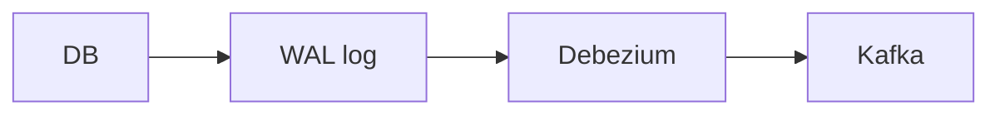

---

## ✔ 効果

* 低遅延
* DB負荷削減
* Outbox競合回避

---

## 根拠

Outbox + CDCは低遅延化に有効 ([dev.to][2])

---

# 6. Sagaの再設計（重要）

## Before（問題）

```text
並列 + 無秩序
→ 補償混乱
```

---

##

[1]: https://www.infoq.com/articles/saga-orchestration-outbox/?utm_source=chatgpt.com "Saga Orchestration for Microservices Using the Outbox ..."
[2]: https://dev.to/haydencordeiro/ensuring-data-consistency-across-microservices-herding-cats-with-saga-outbox-3mhe?utm_source=chatgpt.com "Herding Cats with Saga & Transactional Outbox"

では続きとして、**設計の核心である「Saga/Outboxの再設計」と「構造的スケーリング」**を完成形まで整理します。
ここが今回の一番重要なポイントです。

---

# ■ 6. Saga / Outbox の再設計（最重要）

資料でも示されていた通り、

👉 **Saga + Outbox はスケール時に摩擦を生む構造**
（同期DB書き込み vs 非同期Kafkaの競合） 

---

## ■ Before（問題構造）

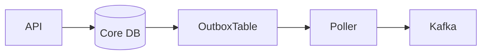

### 問題

* Outbox テーブルに **全トラフィック集中**
* Polling → 遅延 + DB負荷
* Saga状態更新も同一DB
* Kafka lag が累積

---

## ■ After（改善構造）

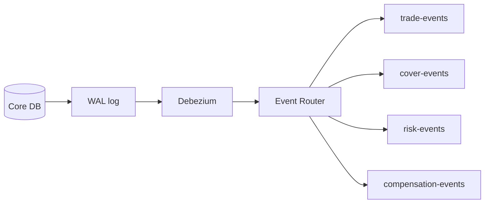

---

## ■ 改善ポイント

### ✔ 1. Polling廃止 → CDC化

* DB → Kafka を非同期Push
* Outboxテーブルは維持（ただし読み取りはCDC）

👉 dual write問題回避 ([InfoQ][1])

---

### ✔ 2. Outboxの「分割」

```text
1テーブル → ❌
複数用途 → 分離
```

| 用途     | テーブル         |
| ------ | ------------ |
| Trade系 | outbox_trade |
| Saga制御 | outbox_saga  |
| 補償     | outbox_comp  |

---

### ✔ 3. Sagaの役割分離

## Before

```text
Trade Saga Service = 全責任
```

## After

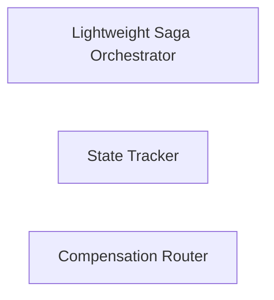

---

## ■ 新Saga構造

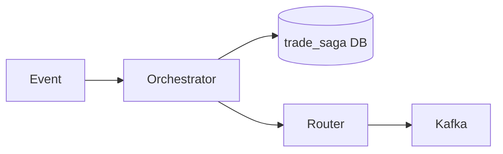

---

## ✔ 役割

### Orchestrator

* 状態遷移判断のみ

### Tracker

* 状態記録（DB）

### Router

* 補償イベント生成

---

## ■ ポイント

👉 「1つの巨大Saga」をやめる

---

# ■ 7. Kafkaボトルネックの根本対策

重要なのはここです。

## ❌ よくある誤解

```text
Kafka lag → broker増やす
```

👉 間違い

---

## ✔ 正しい考え方

👉 **consumerが遅いだけの可能性が高い** ([Confluent][2])

---

## ■ 改善

### ① Consumer並列性

```text
partition数 >= consumer数
```

---

### ② Consumer責務削減

Before:

```text
1 consumer = DB更新 + ロジック + 補償
```

After:

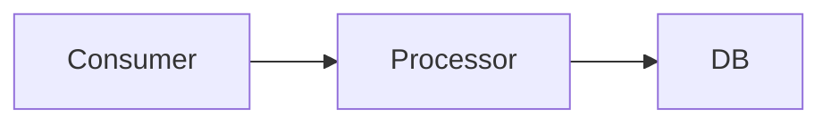

---

### ③ バッチ化

```text
1件ずつ → ❌
バッチ更新 → ✅
```

---

# ■ 8. 「スケールしない理由」の本質

資料の核心はこれです👇

👉 **ボトルネックは移動するだけ** 

---

## ■ 実際に起きていること

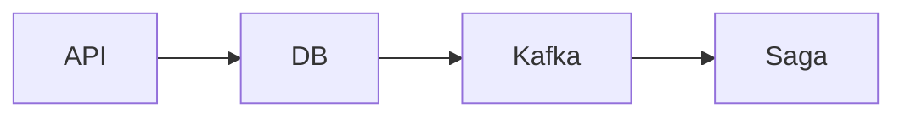

Pod増加すると：

```text
API ↑
→ DB爆発
→ Kafka lag
→ Saga詰まり
```

---

# ■ 真の解決策

```text
「流量」ではなく
「競合点」を減らす
```

---

# ■ 9. 最終アーキテクチャ（完成形）

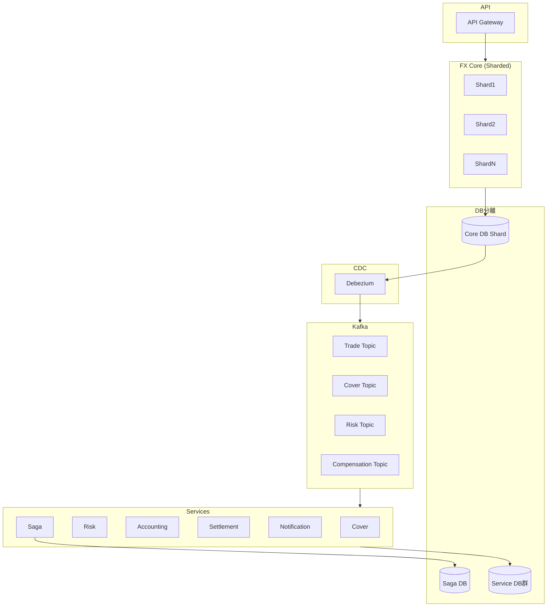

---

# ■ 10. 設計の本質まとめ（超重要）

## ❌ NG設計

* Pod増やせば解決
* Kafka増やせば解決
* DBを強くすれば解決

---

## ✅ 正解

### ① 競合を分解

* DB分離
* Outbox分離
* Saga分離

---

### ② 同期を削減

* ACID領域を極小化
* 履歴非同期化

---

### ③ 非同期を制御

* Kafka partition設計
* consumer設計

---

### ④ 書き込み圧を分散

* shard
* bucket

---

# ■ 最終メッセージ（設計レビュー向け）

**本システムの性能課題はスケールアウト不足ではなく、DB接続、Kafka lag、Saga/Outbox競合といった内部共有資源への圧力集中に起因する構造的問題である。
そのため、Pod数の増加ではなく、Kafkaパーティション設計、DB分離、OutboxのCDC化、ACID領域の縮小、Saga責務分離を組み合わせた構造的スケーリングを採用する。
これにより、負荷は分散されるのではなく競合自体が解消され、システム全体のスループットと安定性が向上する。**

---

必要なら次は👇
👉 「この設計をそのままコード/設定（Kafka/DB/Camel）に落とす」
👉 「k6結果とボトルネックの突き合わせ」
👉 「金融システム監査観点のレビュー」

まで一気に仕上げます。

[1]: https://www.infoq.com/articles/saga-orchestration-outbox/?utm_source=chatgpt.com "Saga Orchestration for Microservices Using the Outbox ..."
[2]: https://www.confluent.io/learn/kafka-scaling-best-practices/?utm_source=chatgpt.com "Apache Kafka® Scaling Best Practices"

結論から言います。

👉 **CQRSは「必須ではない」が、「部分導入は非常に有効」**です。
👉 今回のFXアーキテクチャでは **全面導入はやり過ぎ、選択的導入が正解**です。

---

# ■ まず前提：CQRSとは何を解決するのか

CQRSは

```text
書き込み（Command）と読み取り（Query）を分離する
```

ことで、

* 読み取りと書き込みを独立スケールできる
* 読み取りを高速化（非正規化・キャッシュ）
* 複雑なドメインを整理

というメリットがあります ([Microsoft Learn][1])

---

# ■ 今回の設計に照らした判断

あなたの改善案を踏まえると、ボトルネックはこれでした👇

* DB競合
* Kafka lag
* Outbox競合
* Saga集中

👉 **「書き込み側のボトルネック」**

---

# ■ 重要な結論

## ❌ CQRSで解決できないもの

```text
書き込み性能問題（ACID領域）
```

CQRSは「読み取りの最適化」が主目的なので、

👉 約定処理（ACID）には効きません

---

# ■ なぜか（本質）

CQRSは

```text
READ を分離する
```

ですが、

今回詰まっているのは

```text
WRITE（約定・残高更新・Saga更新）
```

👉 根本原因とズレている

---

# ■ では不要か？ → それも違う

👉 **部分的には強く効きます**

---

# ■ CQRSが効く場所（今回のシステム）

## ① トレード参照（最重要）

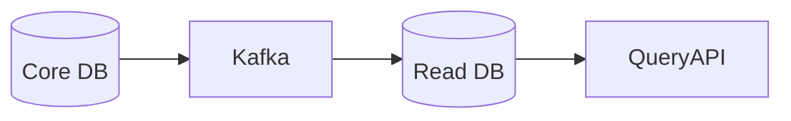

### 対象

* 約定履歴
* 建玉一覧
* 口座サマリ
* Saga状態参照

---

## ✔ 効果

* JOIN削減
* DB負荷軽減
* UI応答高速化

👉 **ここは導入価値が非常に高い**

---

## ② Saga可視化

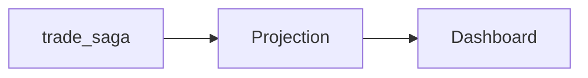

### 効果

* オペレーション可視化
* DBロック回避
* 集計軽量化

---

## ③ レポート / 分析

* 日次損益
* リスク集計
* カバー分析

👉 CQRS必須領域

---

# ■ CQRSを入れてはいけない場所

ここが一番重要です👇

---

## ❌ ACID領域（絶対NG）

```text
約定
残高更新
建玉更新
```

理由：

* 強整合性が必要
* 即時反映が必要
* eventual consistencyは許されない

---

## ❌ Saga制御の正本

```text
trade_saga DB
```

理由：

* 補償判定に使用
* 遅延が許されない

---

# ■ 最適構成（CQRS込み）

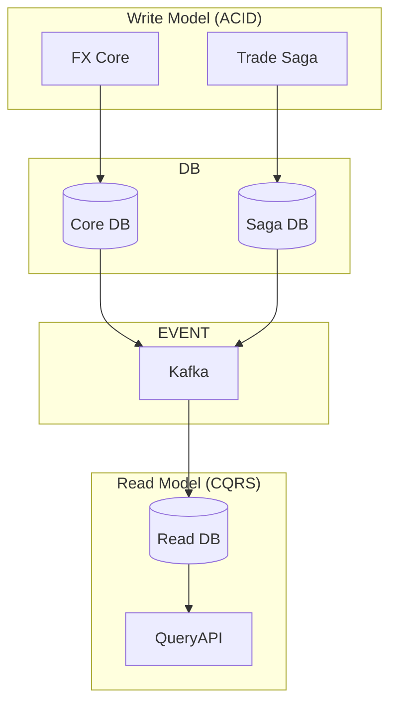

---

# ■ CQRS導入レベル（現実的な判断）

## レベル1（推奨）

👉 **軽量CQRS（論理分離）**

* 同一DB
* 別テーブル or View

---

## レベル2（今回のベスト）

👉 **イベント駆動CQRS（推奨）**

* Kafka → Projection DB
* 読み取り専用DB

---

## レベル3（やりすぎ）

👉 フルCQRS + Event Sourcing

* Event Store
* Snapshot
* 再構築

👉 金融でも限定的

---

# ■ CQRSのデメリット（重要）

導入時の注意点です。

* アーキテクチャ複雑化
* データ不整合（遅延）
* 運用難易度上昇 ([microservices.io][2])

---

# ■ 今回の最終判断（プロ視点）

## ✔ 結論

```text
CQRSは「必要だが、限定的に使う」
```

---

## ✔ 適用範囲

| 領域       | CQRS |
| -------- | ---- |
| 約定（ACID） | ❌ 不要 |
| Saga制御   | ❌ 不要 |
| 参照API    | ✅ 必須 |
| ダッシュボード  | ✅ 必須 |
| レポート     | ✅ 必須 |

---

# ■ 設計レビュー用まとめ

**本システムにおいてCQRSは全面導入の必要はない。
約定・残高更新などのACID領域は強整合性が要求されるため、単一書き込みモデルで維持すべきである。
一方で、約定履歴参照、建玉照会、Saga進行可視化、レポーティングなどの読み取り系については、Kafkaイベントを用いたCQRS（Read Model分離）を導入することで、性能とスケーラビリティを大きく向上させることができる。**

---

# ■ 一言でまとめ

👉 **CQRSは「性能改善の主役」ではない
👉 「読み取り最適化の切り札」**

---

必要なら次は👇
👉 「CQRSを実際にCamel + Kafkaで実装する具体コード」
👉 「Projectionテーブル設計」
👉 「k6でRead/Write分離効果を検証する方法」

まで一気に仕上げます。

[1]: https://learn.microsoft.com/en-us/azure/architecture/patterns/cqrs?utm_source=chatgpt.com "CQRS Pattern - Azure Architecture Center"
[2]: https://microservices.io/patterns/data/cqrs.html?utm_source=chatgpt.com "Command Query Responsibility Segregation (CQRS)"
