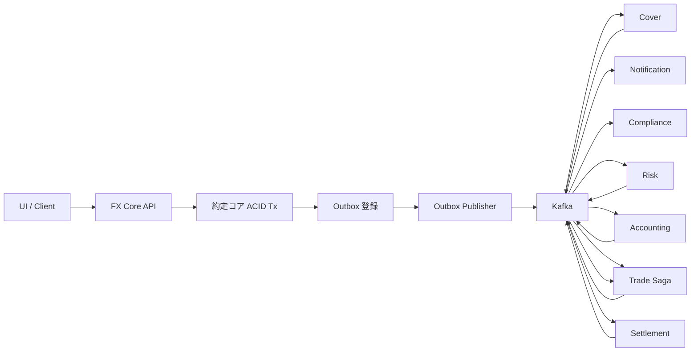
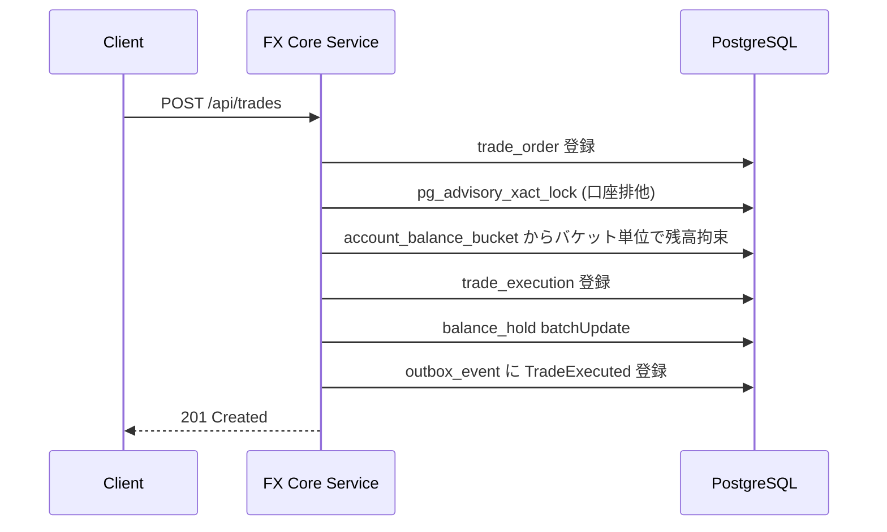
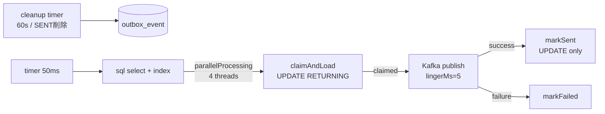
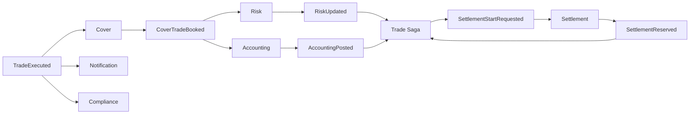
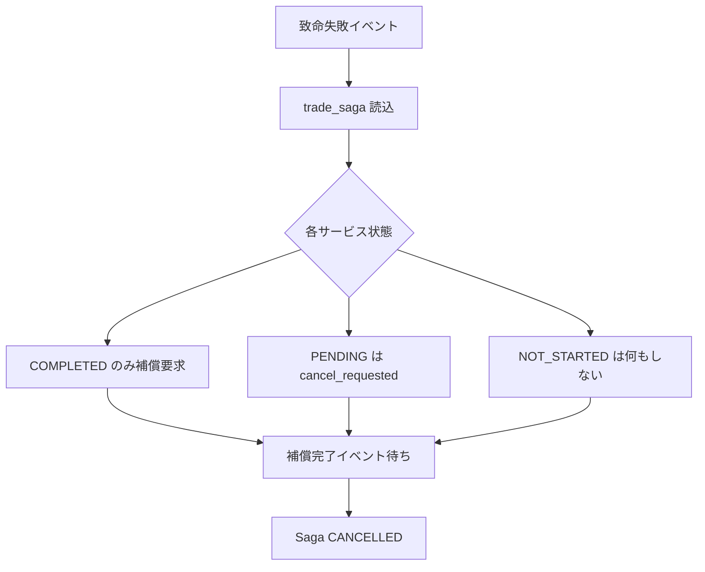
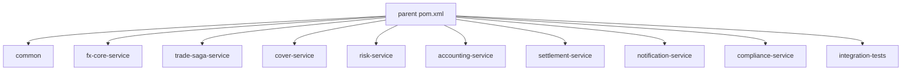
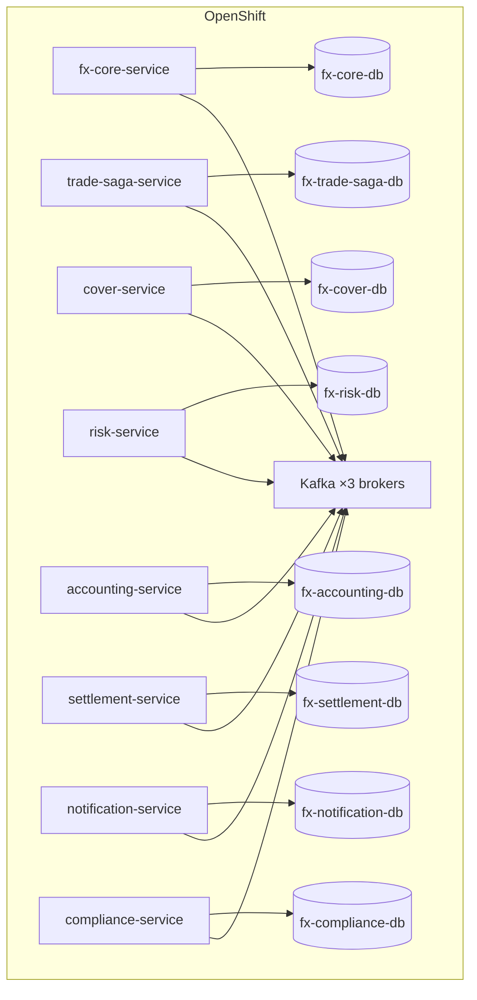
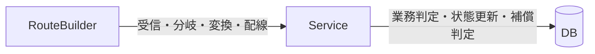
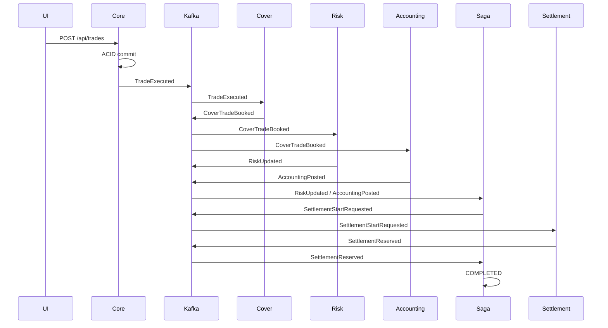
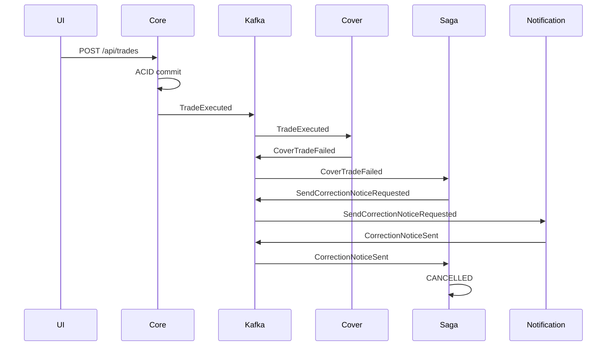

# 実装ガイド

## 1. 目的

本ドキュメントは、`design/design.md` をもとに実装した FX トレーディングサンプルについて、以下を実装視点で説明するものです。

- 処理概要
- トランザクションの詳細
- 実装アーキテクチャ
- 実装の詳細

## 2. 処理概要

このシステムは、取引全体を 2 つの領域に分けています。

- `ACID 領域`: 約定コアを同期・強整合で確定する
- `Saga 領域`: 後続業務を非同期・最終的整合で連携する

### 2.1 高レベル処理フロー



### 2.2 役割分担

#### FX Core Service

- 注文を受ける
- 約定確定
- 残高拘束
- 建玉更新
- `trade_saga` 初期登録
- `TradeExecuted` の Outbox 登録

#### Trade Saga Service

- 各後続サービスの完了/失敗を集約
- 依存関係を見て次工程を起動
- 致命失敗時に補償を開始
- `trade_saga` の進行状態を一元管理

#### 後続サービス

- `Cover Service`
- `Risk Service`
- `Accounting Service`
- `Settlement Service`
- `Notification Service`
- `Compliance Service`

各サービスはローカル DB 更新を行い、自身の結果イベントを Outbox 経由で発行します。

## 3. トランザクションの詳細

## 3.1 ACID 領域

FX Core Service では、以下を 1 トランザクションで処理します。



### ACID 領域で守っていること

- `trade_execution` と残高拘束が分離しない
- `TradeExecuted` の送信漏れを Outbox で防ぐ
- 顧客への応答は後続 Saga 完了を待たずに返せる
- ACID TX を極小化し、ロック保持時間を短くする

**注意**: `fx_position`（建玉）の更新は `PositionProjectionConsumerRoute` が Kafka 経由で非同期実行する。`trade_saga` の初期登録は `trade-saga-service` が `TradeExecuted` を消費して `seed()` で行う。いずれも ACID TX には含まない。

## 3.2 Outbox

Outbox は、`outbox_event` テーブルをポーリングして Kafka に送信します。



### Outbox 実装ポイント

- `status in ('NEW','RETRY')` のみ対象（部分インデックス `idx_outbox_event_poll` で高速化）
- `claimAndLoad` で claim と行取得を **1 DB 往復**（`UPDATE ... RETURNING *`）
- `parallelProcessing()` + 固定プール（4 スレッド）で並列配信（Hikari 接続枯渇を防止）
- `markSent` / `markFailed` はルートヘッダからコンテキスト受領、冗長な `findById` なし
- 1 イベントの配信: **2 DB 往復**（旧: 4〜5 往復）
- 成功時は `SENT`、失敗時は `RETRY` または `ERROR`
- SENT 済みイベントは 60 秒ごとに 5 分経過分を最大 500 件クリーンアップ
- 送信履歴は `trade_activity` にも記録（非同期キュー経由）

## 3.3 Saga 領域

後続業務は完全並列ではなく、依存関係を持っています。



### Saga で守っていること

- Cover 完了前に Risk / Accounting を起動しない
- Risk と Accounting の両方がそろってから Settlement に進む
- Notification 失敗は非致命として扱える
- 致命失敗は補償へ遷移する

## 3.4 補償

補償は「全部戻す」ではなく、`trade_saga` の状態を見て限定実行します。



### 補償の特徴

- DB ロールバックではない
- 逆取引・取消仕訳・訂正通知で表現する
- 成功済みのものだけ戻す
- 未着手のものは起動しない

## 4. 実装アーキテクチャ

## 4.1 バックエンド構成

`backend/` は Maven マルチモジュールです。



### 各モジュールの役割

#### `common`

- 共通イベント定数
- 共通 JSON サポート
- Outbox サポート
- 追跡用 `trade_activity` 記録サポート
- 共通 Outbox Publisher Route

#### `fx-core-service`

- 取引受付 API
- ACID 領域の実装
- `GET /api/trades/{tradeId}/trace`

#### `trade-saga-service`

- Saga 状態管理
- 依存関係の判定
- 補償要求の発行

#### `integration-tests`

- Kafka / PostgreSQL 付き結合テスト
- 正常系と補償系の検証

## 4.2 コンテナ構成

ローカルは `podman compose`（単一 DB）、OpenShift は **サービス別 DB 分離構成**（8 DB）です。



DB 分離の効果: ACID 領域の同期書き込みと後続サービスの更新が **異なる PostgreSQL インスタンス**に分散され、接続・ロック競合が緩和される。詳細は `design/db-separation-plan.md` を参照。

## 4.3 フロントエンド構成

フロントエンドは `Next.js` で、単なる図解ではなくライブ追跡を行います。

```mermaid
flowchart LR
    U[Browser]
    N[Next.js UI]
    API1[/api/trades]
    API2[/api/trades/{tradeId}/trace]
    CORE[FX Core Service]

    U --> N
    N --> API1 --> CORE
    N --> API2 --> CORE
```

### UI が行っていること

- リクエスト条件を選ぶ
- `POST /api/trades` を実行する
- `tradeId` を保持する
- `GET /api/trades/{tradeId}/trace` を 1 秒間隔でポーリングする
- 活動履歴、サービス状態、Outbox 状態をライブ表示する

## 5. 実装の詳細

## 5.1 主要テーブル

実装で主要なテーブルは次のとおりです。

- `trade_order`
- `trade_execution`
- `account_balance`
- `balance_hold`
- `fx_position`
- `trade_saga`
- `outbox_event`
- `processed_message`
- `trade_activity`

### `trade_saga`

Saga の進行を一元管理します。

- `saga_status`
- `cover_status`
- `risk_status`
- `accounting_status`
- `settlement_status`
- `notification_status`
- `compliance_status`
- `*_cancel_requested`

### `outbox_event`

非同期発行の送信保証を担います。

- `NEW`
- `IN_PROGRESS`
- `RETRY`
- `SENT`
- `ERROR`

### `trade_activity`

ライブトレース UI のための活動履歴です。

- どのサービスが
- どの処理を
- どの状態で
- いつ実行したか

を記録します。

## 5.2 Camel の使い方

実装では、ルーティングと配線を Camel 4 に寄せています。

### 採用している主な EIP / Component

- `timer`
- `sql`
- `split` + `parallelProcessing` + `executorService`
- `filter`
- `choice`
- `toD`
- `kafka`（`consumersCount=2`, `CooperativeStickyAssignor`, `lingerMs=5`）
- `direct`
- `doTry / doCatch`

### Camel と Service の責務分離



#### RouteBuilder に置いているもの

- Kafka 入出力
- SQL ポーリング
- ヘッダ設定
- イベント分岐
- Bean 呼び出し

#### Service に置いているもの

- 約定判定
- 残高更新
- 状態遷移
- 補償対象判定
- 冪等判定

## 5.3 ライブトレース API

### `POST /api/trades`

取引を実行します。

主な入力:

- `accountId`
- `currencyPair`
- `side`
- `orderAmount`
- `requestedPrice`
- 各種 `simulate*Failure`

返却:

- `tradeId`
- `orderId`
- `sagaStatus`
- `correlationId`

### `GET /api/trades/{tradeId}/trace`

実行中のトレードの状態を返します。

返却内容:

- 取引状態
- Saga 状態
- サービス別状態
- Outbox イベント一覧
- 活動履歴
- 残高
- 建玉要約

## 5.4 実装済みシナリオ

### 正常系



### カバー失敗



## 5.5 テスト

### 結合テスト

`integration-tests` では Testcontainers を用い、以下を検証しています。

- Kafka / PostgreSQL 起動
- 全サービス同時起動
- `TradeExecuted -> COMPLETED`
- `CoverTradeFailed -> CANCELLED`

### フロントエンド

- `eslint`
- `next build`

## 6. 実行手順

### バックエンド

```bash
cd backend
mvn -DskipTests package
podman compose -f compose.yaml up -d --build
```

### フロントエンド

```bash
cd frontend
npm install
npm run dev
```

## 7. 現在の PoC の位置づけ

この実装は PoC であり、以下は簡略化しています。

- 部分約定は未対応
- 実市場接続は未実装
- 認証認可は簡略化
- Outbox 発行は Timer ポーリング（Debezium CDC は未導入）
- シャーディング（約定コア分割）は設計文書のみ

ただし、以下の本質的な設計要素は実装済みです。

- ACID と Saga の境界
- Outbox + Consumer 冪等（`claimAndLoad` による DB 往復最適化含む）
- 補償の業務的打消し
- 後続依存関係
- ライブトレース UI
- サービス別 DB 分離（OpenShift: 8 DB 構成）
- 残高バケット化（16 分割で行ロック分散）
- `trade_activity` 非同期バッチ化
- Kafka 3 broker / 6 パーティション / `consumersCount=2`
- Outbox 並列配信（4 スレッド制限）+ SENT クリーンアップ
- Observability（Prometheus / Grafana / Loki / Tempo）
- k6 負荷試験スイート（フルスイート / スパイク / レプリカ比較 / 接続バジェット検証）
