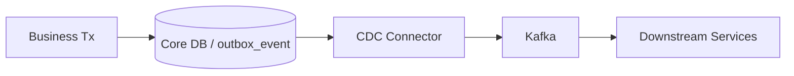

# Outbox CDC 移行計画

## 1. 目的

本ドキュメントは、現行の **polling publisher ベース Outbox** から、将来的に **CDC / push ベース relay** へ移行するための設計方針を定義する。

前提:

- Outbox は「暫定策」ではなく、現行アーキテクチャの中核である
- ただし polling publisher は高負荷で限界を持つ
- 将来の event-driven 強化では、Outbox は **導入済みパターン** から **進化前提の基盤** として扱う必要がある

現行の Outbox は正しいパターンであり、PoC としても妥当である。一方で、高負荷になると次の問題が発生しやすい。

- poll interval 短縮による DB 負荷増
- `outbox_event` テーブルへの集中書き込み
- インデックス肥大
- claim / publish / mark の DB 往復
- relay 並列化による接続プール占有

これは Outbox が誤っているのではなく、polling relay の実装形態が律速し始めるためである。

## 2. 現行構成

現行構成の基本は以下である。

1. ACID トランザクションで業務更新 + `outbox_event` 追加
2. poller が `NEW` / `RETRY` を取得
3. claim 後に Kafka publish
4. `SENT` / `FAILED` へ更新

補足:

- 現行のイベントは integration event として扱う
- 将来 Event Sourcing を全面採用するわけではないため、Outbox を event store と誤認しない

改善済み項目:

- 部分インデックス
- `UPDATE ... RETURNING`
- SENT クリーンアップ
- relay 並列数制限
- poll interval 調整

## 3. 移行の背景

CDC を検討するのは、Outbox パターンが誤っているからではない。次の状態になったとき、polling ベース relay の限界が近いと判断する。

### 3.1 発火条件

1. relay 側の DB アクセスが無視できない
2. `outbox_event` の肥大で poll コストが上がる
3. poll interval を詰めても lag 回復が鈍い
4. relay 並列化で Hikari pool を圧迫する
5. topic / aggregate ごとに relay 分割が必要になる

6. `trace` / 監査 / read model 強化のためにイベント配信の安定性を一段上げたい

## 4. 目標状態

### 4.1 目標アーキテクチャ



### 4.2 目標

- relay の poll を無くす
- DB への追加読み取りを減らす
- publish 遅延のばらつきを減らす
- topic 別 / aggregate 別のルーティングを明確にする
- CQRS read model や監査系 projection へ安定的に feed できるようにする

## 5. 候補方式

### 5.1 Debezium + Kafka Connect

第一候補。`outbox_event` の変更をトランザクションログから読み取り、Kafka へ送る。

利点:

- poll 不要
- DB 追加クエリを減らせる
- relay ワーカーをアプリ外へ出せる
- CQRS / materialized view / 監査系への feed を安定化しやすい

注意点:

- Kafka Connect / Debezium の運用が増える
- 監視対象が増える
- connector 障害時の回復設計が必要

### 5.2 自前 CDC / WAL tail

基本的には非推奨。PoC や学習用途を除き、自前実装は保守コストが高い。

## 5.3 本サンプルで採る実装方針

次フェーズで本サンプルが採るべき方針は、**Debezium + Kafka Connect による PostgreSQL WAL tail** を第一候補とする。

理由:

1. 現行アーキテクチャは PostgreSQL + Kafka + Outbox を既に採用しており、Debezium との親和性が高い
2. Consumer 側冪等、event schema、topic 構造がすでに存在する
3. `trace` / 監査 / CQRS read model の feed を安定化できる
4. polling publisher の接続消費と poll 負荷を relay 外へ逃がせる

採らないもの:

- 自前 WAL parser
- DB trigger ベースの hand-written relay
- Kafka を event store とみなす設計

## 6. 現行 Outbox から何が変わるか

### 6.1 変わらないもの

- 業務データ更新と Outbox 登録は同一 ACID トランザクション
- Consumer 側冪等
- event payload と event schema
- 補償系を含むイベント駆動

### 6.2 変わるもの

- publish の責務主体がアプリ内 poller から CDC connector へ移る
- `status=NEW/RETRY/SENT` 中心の制御から、connector 側の delivery / retry 管理へ一部移る
- poll interval 調整が不要になる
- relay の DB 接続使用量が減る
- read model 更新の上流がより安定する

### 6.3 変えない契約

CDC へ移行しても、次の契約は維持する。

- `event_id` 単位の Consumer 側冪等
- `tradeId` を message key とする順序保証範囲
- `event_type` / `topic_name` / `correlation_id` の payload 契約
- 補償イベントを含む topic の役割分担

## 7. スキーマ設計方針

CDC 移行後も `outbox_event` テーブルは次の役割を持つ。

- DB 更新とイベントの原子的保存
- event ordering の保持
- event metadata の標準化
- 監査 / 再送の基準点

ただし、これは event store ではない。`outbox_event` は integration event relay の基準点であり、aggregate 状態を replay で再構築するための履歴ストアとは分けて考える。

必須列:

- `event_id`
- `aggregate_type`
- `aggregate_id`
- `event_type`
- `topic_name`
- `message_key`
- `payload`
- `correlation_id`
- `source_service`
- `created_at`

CDC 移行後に見直す候補:

- `status`
- `retry_count`
- `next_retry_at`
- `sent_at`

これらは relay 管理用途が強いため、CDC 導入後は役割を縮小または再定義できる可能性がある。

## 7.1 PostgreSQL 側の前提設定

Debezium 導入時は、source DB 側で次を前提とする。

- `wal_level=logical`
- replication slot の作成を許容
- publication の作成を許容
- WAL 保持量と connector lag の監視

OpenShift 上の Postgres を使う場合は、少なくとも次を runbook 化する。

1. `SHOW wal_level`
2. replication slot 一覧確認
3. publication 一覧確認
4. WAL 使用量確認

## 7.2 Connector が読む対象

Debezium が読む対象は次に限定する。

- source table: `outbox_event`
- source database: `fx-core-db` を第一候補

将来は shard ごとに次を増やす。

- `fx-core-db-shard-1`
- `fx-core-db-shard-2`
- ...

## 7.3 Outbox Event Router 方針

Debezium 標準の Outbox Event Router を使う場合、次の列をルーティングに使う。

- `event_id`
- `aggregate_type`
- `aggregate_id`
- `event_type`
- `topic_name`
- `message_key`
- `payload`

方針:

- topic は `topic_name` をそのまま使う
- Kafka key は `message_key` を使う
- event payload は既存 `payload` をそのまま流す
- source table 名は downstream へ露出させない

## 8. OpenShift 配置設計

### 8.1 コンポーネント

最低限必要な要素:

1. Kafka Connect Deployment
2. Debezium PostgreSQL connector plugin
3. connector 設定 Secret / ConfigMap
4. connector status を scrape する監視設定

### 8.2 初期配置方針

PoC 段階では次を推奨する。

- `connect` は 1 replica
- plugin は PostgreSQL connector のみ
- source DB は `fx-postgres` または `fx-core-db`
- sink は既存 Kafka cluster

本番相当で必要になるもの:

- Connect 複数 replica
- persistent internal topics
- connector config の Secret 化
- restart / rebalance の運用手順

### 8.3 命名

例:

- Deployment: `fx-kafka-connect`
- Connector: `fx-core-outbox-connector`
- Secret: `fx-kafka-connect-secrets`
- ConfigMap: `fx-kafka-connect-config`

## 9. Connector 設定テンプレート

次フェーズでの初期テンプレートは次のイメージとする。

```json
{
  "name": "fx-core-outbox-connector",
  "config": {
    "connector.class": "io.debezium.connector.postgresql.PostgresConnector",
    "database.hostname": "fx-postgres",
    "database.port": "5432",
    "database.user": "fx",
    "database.password": "fx",
    "database.dbname": "fx_trading",
    "database.server.name": "fx-core-db",
    "topic.prefix": "fx-core-cdc",
    "schema.include.list": "public",
    "table.include.list": "public.outbox_event",
    "plugin.name": "pgoutput",
    "publication.autocreate.mode": "filtered",
    "slot.name": "fx_core_outbox_slot",
    "transforms": "outbox",
    "transforms.outbox.type": "io.debezium.transforms.outbox.EventRouter",
    "transforms.outbox.route.by.field": "topic_name",
    "transforms.outbox.route.topic.replacement": "${routedByValue}",
    "transforms.outbox.table.field.event.id": "event_id",
    "transforms.outbox.table.field.event.key": "message_key",
    "transforms.outbox.table.field.event.payload": "payload"
  }
}
```

補足:

- 上記は本番値ではなく初期 PoC 用の雛形
- Secret 化対象は `database.user/password`
- `topic.prefix` は監視や internal topic 識別のために残す

## 10. 切替パターン

### 10.1 Pattern A: Shadow topic

もっとも安全な方式。

- poller は本番 topic へ publish 継続
- CDC は shadow topic へ publish
- payload / order / 欠落 / projection 整合を比較

### 10.2 Pattern B: Dual feed compare

- poller と CDC の両方を同一 topic へ流さない
- compare 専用 consumer で差分検出する

### 10.3 Pattern C: Full cutover

- poller を停止
- CDC connector を本番 topic へ向ける
- rollback は poller 再開で戻す

推奨順:

1. Shadow topic
2. Dual feed compare
3. Full cutover

## 11. 移行ステップ

### Phase 0: 前提整備

- event schema を固定する
- `topic_name` と `message_key` の設計を固定する
- Consumer 側冪等を再確認する
- `event_id` での監査トレースを確立する
- read model 更新先がある場合は downstream 側の再処理手順を定義する
- PostgreSQL の `wal_level=logical`、slot、publication を確認する
- Kafka Connect の image / plugin 配置方法を決める

### Phase 1: 並行検証

- 現行 poller は本番経路のまま維持
- 別系統で CDC connector を立てる
- 同一イベントが同一順序で観測されるか確認する
- latency / lag / DB 負荷を比較する
- Connect / Debezium 自体の CPU / memory / restart を観測する

### Phase 2: shadow publish

- CDC 側を shadow topic へ publish
- payload 差分、順序差分、欠落の有無を検証
- 監視項目を確立する
- read model 側 projection の整合も比較する
- replay / connector 再起動時の重複を確認する

### Phase 3: 切替

- poller を停止
- CDC publish を本番 topic へ切替
- rollback 条件と手順を明記する
- shadow topic を compare 専用で一定期間残す

## 12. 運用設計

### 9.1 監視項目

- connector status
- connector restart count
- connector lag
- source DB WAL lag
- event publish latency
- downstream consumer lag
- connector task state
- connector error count
- shadow topic 差分件数

### 9.2 障害時の確認点

- connector が止まっていないか
- source DB 側のログ保持が不足していないか
- topic 側で backpressure が発生していないか
- same `event_id` の重複 publish が起きていないか
- slot lag が過大になっていないか
- publication 対象から `outbox_event` が外れていないか

## 13. リスク

- Kafka Connect / Debezium の運用追加
- connector 障害時の復旧手順が必要
- DB ログ保持と connector lag の管理が必要
- PoC としては構成が大きくなる
- source DB の WAL 膨張が運用課題になる
- 切替時に duplicate / gap の比較設計が甘いと誤判定する

## 14. 判断基準

次の条件なら CDC 導入を推奨する。

1. relay 起因の DB 負荷が観測できる
2. poll interval 短縮でしか遅延を抑えられない
3. relay 並列化が接続枯渇リスクになる
4. topic / aggregate ごとの relay 分割が必要
5. CQRS / 監査 projection へより安定した feed が必要

逆に、PoC 規模で relay 最適化だけで十分なら、polling publisher 継続でもよい。

## 14.1 次フェーズでの位置づけ

次フェーズでは、CDC は「余裕があればやる改善」ではなく、Outbox が主要基盤であり続けるための強化策として扱う。  
特に `trace`、監査 read model、運用ダッシュボードのイベント供給元を安定化したい場合、CDC の優先度は上がる。

## 15. テスト計画

CDC 切替時に最低限実施する試験:

1. **順序試験**
   - 同一 `tradeId` のイベント順序が保たれるか
2. **重複試験**
   - connector restart 時に duplicate しても Consumer 冪等で吸収できるか
3. **欠落試験**
   - DB commit 済みイベントが Kafka に欠落しないか
4. **遅延試験**
   - poller と CDC の publish latency を比較する
5. **read model 整合試験**
   - `trace` / 監査 projection が shadow topic と同一結果になるか

## 16. 完了条件

1. poller 継続 / CDC 移行の判断基準が数値化されている
2. Debezium / Kafka Connect の配置案が決まっている
3. connector テンプレートが定義されている
4. event schema と監視項目が固定されている
5. 切替 / rollback / shadow compare 手順が定義されている
