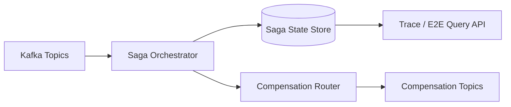

# Saga 分割設計計画

## 1. 目的

本ドキュメントは、現行の `Trade Saga Service` を将来の高負荷運用に耐える形へ再設計するための分割方針を定義する。

前提:

- Saga は「導入済みで終わり」ではなく、負荷・失敗系増加に合わせて分割されるべき中核構造である
- 本サンプルはオーケストレーション寄り Saga を採っており、その方向性自体は維持する
- ただし、単一サービスに状態・進行・補償を集約し続ける設計は将来の律速になる

現行構成では、`Trade Saga Service` が次の責務をまとめて持ちやすい。

- 状態遷移管理
- 下流イベント受信
- 補償開始判定
- 補償イベント発行
- E2E 状態照会用の集約

この構成は PoC では扱いやすいが、負荷や失敗系が増えると次の問題が発生する。

- `trade_saga` への書き込み集中
- イベント順序逆転時の分岐増大
- 補償ロジックの肥大化
- E2E 状態照会と状態更新の干渉
- サービス障害時の責務切り分け不能

したがって、Saga は「複雑だから避ける」対象ではなく、「維持するが、責務ごとに進化させる」対象として扱う。

## 2. 分割方針

### 2.1 分割後の責務

次フェーズでは、Saga を次の 3 つへ分離する。

1. **Saga Orchestrator**
   - downstream イベントを受ける
   - 次の進行判断を行う
   - 状態更新依頼や補償依頼を発行する

2. **Saga State Store / Query**
   - `trade_saga` の更新と取得に専念する
   - 状態遷移の整合性を保証する
   - E2E 照会 API の read source になる

3. **Compensation Router**
   - 補償開始条件の確定
   - 補償イベント発行
   - 補償完了待ちと終端判定

## 3. 分割しないもの

- ACID 境界は `fx-core-service` に残す
- Kafka / Camel ルートは配線専用に留める
- 補償そのものの実行は各 downstream service が担当する
- 業務ロジックは Service 層で扱う

## 3.1 Event-driven 観点での位置づけ

本設計では Saga を event-driven microservices の中核制御として扱う。ただし、次の点を明確にする。

- Saga は Event Sourcing を前提にしない
- Saga の source of truth は event log ではなく `trade_saga` 状態と downstream 実データの組み合わせである
- 監査や trace は event-centric に扱えるが、Saga 完了判定は state store によって確定する

## 4. 目標アーキテクチャ

## 5. 各コンポーネントの詳細

### 5.1 Saga Orchestrator

役割:

- `TradeExecuted`, `CoverTradeBooked`, `RiskUpdated`, `AccountingPosted`, `SettlementReserved`, `NotificationSent`, `ComplianceChecked` などを受信
- 依存関係に従って次の状態を判断
- State Store へ遷移依頼を送る
- 補償開始が必要なら Compensation Router へ依頼する

責務に含めないもの:

- 直接 DB 更新
- 補償イベントの組み立て
- E2E 照会用 read model 生成

期待効果:

- イベント配線と業務更新責務を分離できる
- Orchestrator を stateless に近づけられる
- 再送や idempotency を整理しやすい

### 5.2 Saga State Store / Query

役割:

- `trade_saga` の更新 API を持つ
- 状態遷移の前提条件を検証する
- `tradeId` 単位の最新状態を返す
- `trace` / `e2e-status` 用の read source になる

補足:

- ここは将来的な CQRS read model の feed 元にもなり得る
- ただし Query API は state store を直接公開せず、必要に応じて read model へ移す

状態更新の原則:

- 更新は `tradeId` 単位の単純な upsert ではなく、**期待状態付き更新** を基本にする
- 不正な巻き戻りを禁止する
- `eventId` と `correlationId` を記録し、重複更新を弾けるようにする

期待効果:

- `trade_saga` を正面から管理できる
- Query API と更新経路の責務が明確になる
- Saga 状態を独立に最適化しやすい

### 5.3 Compensation Router

役割:

- 補償開始条件の評価
- `REVERSE_RISK_REQUESTED` などの補償要求イベントを組み立てる
- 補償の進捗を監視する
- `CANCELLED` / `FAILED` / `REVIEW_PENDING` などの終端判定を行う

責務に含めないもの:

- 通常系イベントの配線
- 補償実処理
- 約定コアのロールバック

補足:

- 補償はロールバックではなく業務的打消しである
- `Requested -> Running -> Compensated/Failed` の遷移を標準化する

期待効果:

- 通常系と補償系のコードを分離できる
- 補償の可観測性が大幅に上がる
- 補償系だけを独立に強化しやすい

## 6. 状態モデル

### 6.1 Saga 全体状態

候補:

- `PENDING`
- `RUNNING`
- `COMPLETED`
- `COMPENSATING`
- `CANCELLED`
- `FAILED`
- `REVIEW_PENDING`

### 6.2 各ステップ状態

候補:

- `PENDING`
- `RUNNING`
- `COMPLETED`
- `FAILED`
- `COMPENSATION_REQUESTED`
- `COMPENSATED`

### 6.3 状態遷移原則

- 後退遷移を禁止する
- 補償開始後は通常系の `COMPLETED` 判定だけで完了扱いしない
- 同一 `eventId` による重複更新は no-op にする

## 7. イベント設計

### 7.1 必須ヘッダ / payload 項目

- `tradeId`
- `orderId`
- `correlationId`
- `eventId`
- `eventType`
- `sagaStatus`
- `sourceService`

### 7.2 補償イベントの標準化

候補イベント:

- `CoverReversalRequested`
- `RiskReversalRequested`
- `AccountingReversalRequested`
- `SettlementCancelRequested`
- `CorrectionNoticeRequested`

命名原則:

- 要求イベントは `Requested`
- 実行完了は `Compensated`
- 異常終了は `Failed`

## 8. 依存関係の扱い

現行依存:

- `TradeExecuted` -> Cover / Notification / Post-Trade Compliance
- `CoverTradeBooked` -> Risk / Accounting
- `RiskUpdated` + `AccountingPosted` -> Settlement

分割後も依存関係そのものは維持する。変更点は、依存判定を単一の大きな Service 内で持つのではなく、Orchestrator が判定し、State Store が確定し、Compensation Router が異常系のみ扱う点である。

依存関係は今後も「完全並列」へ戻さない。特に `CoverTradeBooked -> Risk / Accounting -> Settlement` の因果関係は維持し、補償設計もこの依存グラフに従う。

## 9. 可観測性

各コンポーネントで最低限出すべきメトリクス:

- `fx_saga_transition_total`
- `fx_saga_transition_failed_total`
- `fx_compensation_requested_total`
- `fx_compensation_completed_total`
- `fx_compensation_failed_total`
- `fx_saga_state_update_latency`
- `fx_saga_e2e_duration`

ログ必須項目:

- `tradeId`
- `orderId`
- `correlationId`
- `eventId`
- `sagaStatus`

## 10. 実装ステップ

### Step 1

- `trade_saga` 更新ロジックを State Store 相当へ抽出
- Query API をそこへ寄せる

### Step 2

- 補償判定と補償イベント組み立てを Compensation Router 相当へ抽出

### Step 3

- Orchestrator から直接 DB を触らない構造へ整理

### Step 4

- metrics / logs / trace を各責務単位で分ける

### Step 5

- `trace` / `e2e-status` を将来 CQRS read model へ逃がせるよう、state update event を標準化する

## 11. リスク

- サービス数が増え、PoC としては複雑になる
- イベント数が増え、運用コストが上がる
- 分割しすぎると逆に観測や保守が難しくなる
- event ordering と state update ordering の不整合に注意が必要

## 11.1 採用判断

次の条件が見えたら Saga 分割の優先度を上げる。

1. `trade_saga` への書き込み集中が主要ボトルネック
2. 補償ロジック変更が通常系へ悪影響を与える
3. `trace` / `e2e-status` 照会が状態更新と競合する
4. 障害解析時に「通常系の遅延か補償系の遅延か」が分からない

## 12. 完了条件

この設計書の完了条件は次のとおり。

1. Orchestrator / State Store / Compensation Router の責務境界が決まっている
2. `trade_saga` の状態遷移ルールが決まっている
3. 補償イベント命名と終端条件が決まっている
4. 監視指標とログ項目が定義されている
