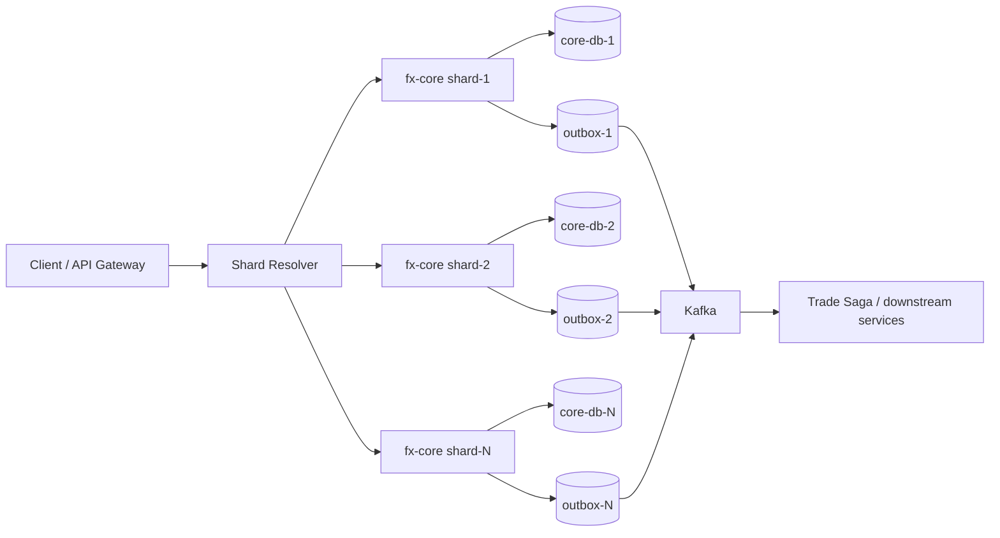

# シャーディング・ドメイン分割ロードマップ

## 1. 目的

本ドキュメントは、`fx-core-service` の **単一約定コア + 単一 ACID 境界** が将来的に頭打ちになった場合に備え、次フェーズで検討すべき **シャーディング** と **ドメイン分割** の設計方針を整理するものである。

前提は次のとおり。

- 現行構成では、約定確定、残高拘束、建玉更新、`TradeExecuted` Outbox 登録までを単一サービス内 ACID で扱う
- 後続業務は Kafka + Saga で接続し、最終的整合性で処理する
- 性能改善の第一段は Outbox 最適化、Kafka 調整、DB 分離、接続予算管理である
- それでもなお **約定コア側が律速** する場合、構造変更としてシャーディングやドメイン分割が必要になる

## 2. いつ検討を開始するか

次のいずれかを満たした時点で、単なるチューニングではなく構造変更の検討フェーズへ移行する。

1. **約定コアがレプリカ増に追随しない**
   - `1 -> 3 -> 5 replicas` で `POST 201 rate` が頭打ち
   - `fx-core-service` の p95 / p99 が悪化
   - 後続より先に ACID コア側が遅くなる

2. **DB 接続予算が先に限界へ到達する**
   - `loadtest/verify_db_connection_budget.py` で `max_connections` が逼迫
   - `hikaricp_connections_pending` が継続的に上昇
   - `fx-core-db` または `fx-trade-saga-db` の接続総量が増設余地を上回る

3. **口座単位の更新競合が支配的になる**
   - 特定 `accountId` 群への集中で行ロック待ちが支配的
   - `balance bucket` だけでは緩和しきれない
   - 口座単位の書き込みホットスポットが消えない

4. **ビジネス要件が現構成の物理限界を超える**
   - 秒間約定件数の増加
   - 同一口座更新頻度の増加
   - 地域 / 法人 / 商品ごとの独立スケール要求

## 3. 解こうとしている問題

シャーディングやドメイン分割は、単に Pod を増やす代替ではない。次の問題を構造的に解くための施策である。

- `account_balance` / `fx_position` / `trade_execution` 更新の集中
- 単一 DB の WAL、ロック、インデックス更新集中
- `fx-core-service` の接続プール総量増加
- 特定口座・特定商品への更新ホットスポット
- 読み取り照会と書き込み処理の干渉

## 4. 分割の原則

### 4.1 変えないもの

- **約定コアは shard 内で同期・強整合**
- **後続業務は shard 外でも非同期・最終的整合**
- **Outbox による送信保証**
- **Consumer 側冪等**
- **補償は業務的打消し**

### 4.2 禁止事項

- 同一約定リクエストで **複数 shard へ同期書き込みしない**
- shard 間をまたぐ 2PC / XA を導入しない
- Camel ルートで shard 判定や状態管理を持たない
- shard またぎの強整合参照を後続サービスへ要求しない

## 5. 候補となる分割軸

### 5.1 第一候補: `accountId` ベース shard

最も有力な候補。残高拘束、建玉更新、約定記録の整合性主体が口座であるため、業務境界と性能境界が一致しやすい。

メリット:

- 残高・建玉更新の競合を口座単位で局所化できる
- `balance bucket` と相性が良い
- shard key が安定し、ルーティングしやすい

デメリット:

- 複数口座をまたぐ将来要件が出ると設計が難しくなる
- 口座移管 / shard 再配置が必要になる

### 5.2 第二候補: 地域 / 法人単位分割

`region`、法人、顧客セグメント単位で分ける方式。性能だけでなく規制・運用境界にも効く。

向いている場合:

- データ主権要件がある
- 運用組織が地域別に分かれる
- 口座体系が地域ごとに独立している

### 5.3 第三候補: 商品 / ドメイン分割

FX、証券、与信などを業務境界ごとに分離する方式。単一サービスの責務を減らし、スケール特性も分ける。

向いている場合:

- 書き込み特性が商品群で大きく違う
- チーム構成が業務ドメインに沿っている
- 参照モデルや下流イベントが分かれやすい

## 6. 現時点の推奨方針

次フェーズの第一候補は **`accountId` ベース shard** とする。

理由:

1. 現行 PoC の主要競合点が残高拘束・建玉更新であり、口座単位の閉域に落としやすい
2. `TradeExecuted` 以降の Saga は shard 非依存なイベント駆動のまま維持しやすい
3. `balance bucket` の既存設計を shard 内ロック分散へ再利用できる

## 7. 目標アーキテクチャ

原則:

- shard resolver は `accountId -> shardId` を決定する
- 各 shard は独立した core DB と Outbox を持つ
- Kafka 以降の downstream は shard 非依存に処理する

## 8. ルーティング設計

### 8.1 shard key

- 基本キー: `accountId`
- 算出: `hash(accountId) % shardCount`
- 将来の再配置に備え、単純 mod から **論理 shard table** への移行余地を残す

### 8.2 ルーティング責務

- API Gateway ではなく、アプリまたは専用 resolver で決定してよい
- Camel ルートは配線専用とし、shard 判定は Service / resolver 層で実施する
- `tradeId` は global 一意のまま維持し、`accountId` から shard が逆引きできるよう記録する

### 8.3 データ配置

- `trade_execution`, `account_balance`, `balance_hold`, `fx_position`, `outbox_event` は shard 内に持つ
- `trade_saga` は downstream 側に寄せるか、別ストアとして扱う
- 跨 shard 集約は同期参照ではなく read model / batch 集計へ寄せる

## 9. 移行フェーズ

### Phase 0: 観測固定化

- 基準シナリオを固定する
- shard 導入前の p95 / p99 / lag / backlog / connection を保存する
- shard が必要な発火条件を数値で明文化する

### Phase 1: 論理 shard 導入

- `accountId -> shardId` の解決テーブルを導入
- まだ物理分割せず、単一 DB 上で shard 概念だけ導入
- 監視 / 運用 / ログ / trace に `shardId` を出す

### Phase 2: 物理分割

- shard ごとに `fx-core-service` と DB を分離
- shard 別 Outbox / relay を持たせる
- 下流サービスはイベント payload に `shardId` を持つが、同期参照はしない

### Phase 3: 再配置・拡張

- 口座の再配置手順を整備する
- 再配置時の read-only 化、二重書き、切替、検証、ロールバックを runbook 化する
- 必要なら region / product 軸の二次分割を検討する

## 10. 移行時の注意点

### 10.1 二重書きは原則避ける

段階移行では二重書きが魅力的に見えるが、整合性事故を増やしやすい。どうしても必要な場合は:

- 移行対象口座を限定
- 書き込み窓を短くする
- read 側の優先ソースを固定
- 差分検証を自動化

### 10.2 跨 shard 参照を同期化しない

典型的な失敗は、shard 化したあとに「別 shard の残高をリアルタイム参照したい」と戻ってしまうこと。  
跨 shard 要件は次で扱う。

- 事前集約された read model
- 非同期検証
- 業務ルール変更

## 11. リスクとトレードオフ

| 論点 | メリット | デメリット |
|---|---|---|
| `accountId` shard | 最も直接的に競合を分散 | 跨口座要件に弱い |
| 物理 DB 分割 | 接続・WAL・ロックを局所化 | 運用対象が増える |
| resolver 導入 | 将来の再配置に備えられる | ルーティング層が増える |
| downstream 非同期維持 | shard 間強整合を避けられる | read model 設計が必要 |

## 12. 完了条件

次フェーズの設計としては、以下が揃った時点を完了とする。

1. shard key を `accountId` として合意
2. shard resolver の責務と配置場所を決定
3. shard 内テーブル配置を定義
4. `tradeId` / `accountId` / `shardId` の追跡設計を定義
5. 移行フェーズ、ロールバック、検証方法を明文化

## 13. 本リポジトリでの扱い

本リポジトリでは、まず **設計、監視、負荷試験、運用判定基準** を整える。  
本番相当の shard 実装は別フェーズとし、この文書はその判断材料と移行方針を提供する。
